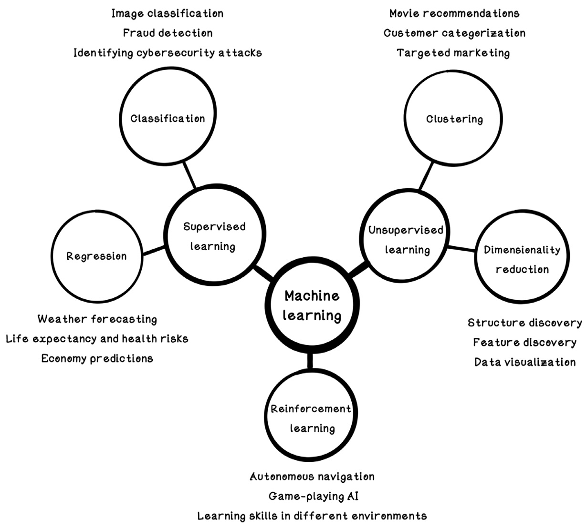
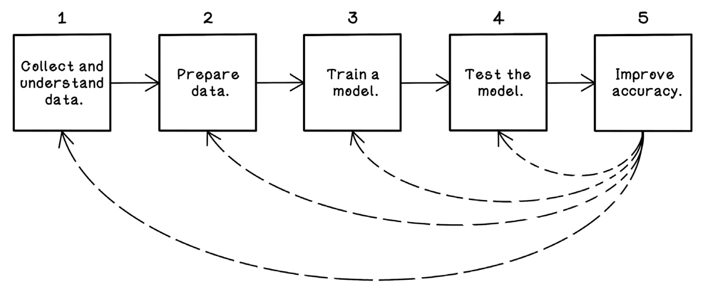

<!-- _paginate: false -->

# Special Topic: Machine Learning (ML) and Artificial Intelligence (AI)

ENGR 103: Engineering Computation and Algorithmic Thinking

Alex Ulbrich

---

# How many of you have used AI *today*?

<!-- FaceID, ChatGPT, Google Search, Voice Assistants, Smartphone Keyboard, Social Media, Video and Music Recommendations, Video Games, Assisted Driving, Smart Thermostats, Smartwatches, CAPTCHAs, ... -->

---

# Example

TODO
<!-- <video src="http://commondatastorage.googleapis.com/gtv-videos-bucket/sample/BigBuckBunny.mp4" controls width="90%"></video> -->

---

# Applications

- Agriculture: optimal plant growth
- Banking: fraud detection
- Cybersecurity: attack detection and handling
- Civil: structural health monitoring
- Mechanical: predictive maintenance in machines
- Healthcare: medical diagnosis of patients
- Logistics: routing and optimization

---

# AI, ML, and Deep Learning

**Artificial Intelligence (AI)** refers to the capability of computational systems to perform tasks typically associated with human *intelligence* (learning, reasoning, problem-solving, perception, and decision-making).

**Machine Learning (ML)** is s subset of AI that learns patterns from data.

**Deep learning** is a subset of machine learning that focuses on utilizing *neural networks*.

<!-- Think of AI like teaching a baby. Show images of how an ML model learns to distinguish between dogs and cats. -->

---

<!-- _class: reference -->

Image from R. Hurbans, Grokking Artificial Intelligence Algorithms.

---

<!-- _class: reference -->

# Basic ML Workflow

1. Collect data (images, sensor readings, text, ...)
2. Train a model (feeding examples)
3. Make predictions (on new data)
4. Improve over time (learning from mistakes)

Image from R. Hurbans, Grokking Artificial Intelligence Algorithms.

---

# Google Colab Exercise

<!-- use https://colab.research.google.com/ -->

---

# Worth Checking

- [AlphaGo Documentary](https://www.youtube.com/watch?v=WXuK6gekU1Y)
- [HuggingFace LeRobot](https://github.com/huggingface/lerobot)
- Conversational AI and Search
  - Grok, ChatGPT, Gemini, LeChat, Copilot
  - Perplexity
