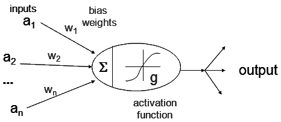

<!-- _paginate: false -->

# Special Topic: Machine Learning (ML) and Artificial Intelligence (AI)

ENGR 103: Engineering Computation and Algorithmic Thinking

Alex Ulbrich

---

# Today's Lecture

- What is AI, ML, Deep Learning?
- A Typical ML Workflow
- Data Collection and Preparation
- Different Models

---

# How many of you have used AI *today*?

<!-- FaceID, ChatGPT, Google Search, Voice Assistants, Smartphone Keyboard, Social Media, Video and Music Recommendations, Video Games, Assisted Driving, Smart Thermostats, Smartwatches, CAPTCHAs, ... -->

---

# Applications

- Agriculture: optimal plant growth
- Banking: fraud detection
- Cybersecurity: attack detection and handling
- Civil: structural health monitoring
- Mechanical: predictive maintenance in machines
- Healthcare: medical diagnosis of patients
- Logistics: routing and optimization

---

# AI, ML, and Deep Learning

**Artificial Intelligence (AI)** refers to the capability of computational systems to perform tasks typically associated with human *intelligence* (learning, reasoning, problem-solving, perception, and decision-making).

**Machine Learning (ML)** is s subset of AI that learns patterns from data.

**Deep learning** is a subset of machine learning that focuses on utilizing *neural networks*.

<!-- Think of AI like teaching a baby. Show images of how an ML model learns to distinguish between dogs and cats. -->

---

<!-- _class: reference -->

# Basic ML Workflow

1. Collect and prepare data (images, sensor readings, text, ...)
2. Train a model (feeding examples)
3. Make predictions (on new data)
4. Improve over time (learning from mistakes)

Image from R. Hurbans, Grokking Artificial Intelligence Algorithms.

---

# Data Collection and Processing

Data scientists often spend **60-80% of their time on data-related tasks**: collecting, cleaning, transforming, and exploring data.

Raw data is **messy**: missing values, outliers, inconsistent formats, or irrelevant features can tank a model’s performance.

**Garbage in, garbage out.** A model’s only as good as its data. Clean, well-prepared data ensures the model learns meaningful patterns, not noise.

Not all datasets are terrible.

When doing supervised learning, we want to have *train* and *test* data.

<!-- Researcher at Hugging Face realized that if you trained your LLM on books/literature, they would perform much worse than if you trained them on the web. -->

---

# Data Processing Example

Voronoi tesselation to compute distances between ~700k people and ~ 1.2k repair shops

<!-- In blue are the in-network repair shops, in purple the out-of-network ones. Yellow are people that are farther than 5km from a repair shop. Orange is >10km. Red is >15 km. Overall less than 10% of people are more than 5 km away from a repair shop. -->

---

<!-- _class: reference -->

Image from R. Hurbans, Grokking Artificial Intelligence Algorithms.

---

# Regression

https://xkcd.com/2048/

<!-- Predict the repair cost after a car crash (from an insurance perspective). -->

---
<!-- _class: reference -->

# Classification

Can we predict Titanic survivors? **Green** mostly survived. **Red** mostly died.

[CS229 Titanic – Machine Learning From Disaster](https://www.semanticscholar.org/paper/CS229-Titanic-%E2%80%93-Machine-Learning-From-Disaster/898ecf83c17d451b1fff47c1f820f3716f1aa21a)

<!-- Predict if a car is totalled or not. -->

---

<!-- Group individuals or families based on certain criteria for advertising purposes. -->

# Clustering

Centroid vs Density

[Source](https://en.wikipedia.org/wiki/Cluster_analysis)

---

# Dimensionality Reduction

Scatter Plots

Principal Component Analyis (PCA)

*Iris Dataset*

---

# Reinforcement Learning

Imagine trying to teach a pup how to sit by giving them a reward if they succeed.

In this case, the model/agent improves when making successful attempts.

[Source](https://en.wikipedia.org/wiki/Reinforcement_learning)

---

# Neural Networks

Nodes (neurons) connected by edges (synapses). Each node receives information from connected nodes, processes it, then sends it to other nodes.

[Source](https://en.wikipedia.org/wiki/Neural_network_(machine_learning))

<!-- Depending on the activation function, the neural network can do classification, regression, or reinforcement learning. -->

---

# Evaluating Model Quality

It depends on the type of model:

- classification: **confusion matrix** or similar
- regression: some measure of the "error"
- reinforcement learning: some measure of the "reward"

All metrics have some trade-offs.

<!-- Example: the accuracy of a classification model can be highly skewed depending on the sample size. But if having false negatives or false positives is bad (e.g., false negative for a cancer diagnostic) the accuracy shouldn't be used as such. -->

---

# Google Colab Exercise

Classifying handwritten digits: [MNIST Database](https://en.wikipedia.org/wiki/MNIST_database)

Using neural networks (simple to complex).

Open [https://colab.research.google.com/](https://colab.research.google.com/) to get started.

Code is [available on GitHub](https://github.com/adulbrich/engr103-special-topics/blob/main/machine-learning/mnist_classification.ipynb) as well.

<!-- use https://colab.research.google.com/ -->

---

# Worth Checking

- [AlphaGo Documentary](https://www.youtube.com/watch?v=WXuK6gekU1Y)
- [HuggingFace LeRobot](https://github.com/huggingface/lerobot)
- Conversational AI and Search: Grok, ChatGPT, Gemini, LeChat, Copilot, Perplexity
- [Teachable Machine](https://teachablemachine.withgoogle.com/)
- [TensorFlow Playground](https://playground.tensorflow.org/)
- [Kaggle's Intro to Machine Learning](https://www.kaggle.com/learn/intro-to-machine-learning)
- [AI Dungeon](https://play.aidungeon.com/)
- [Quick, Draw!](https://quickdraw.withgoogle.com/)