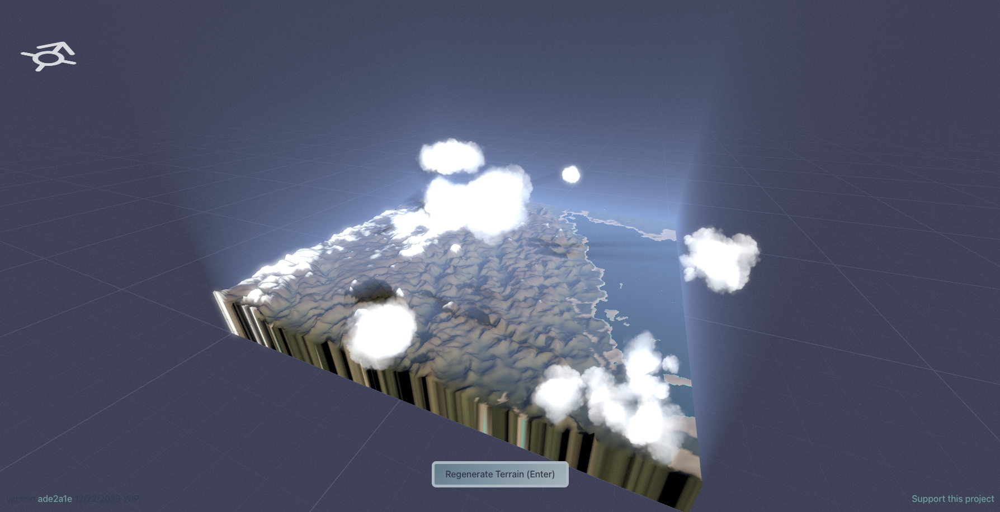
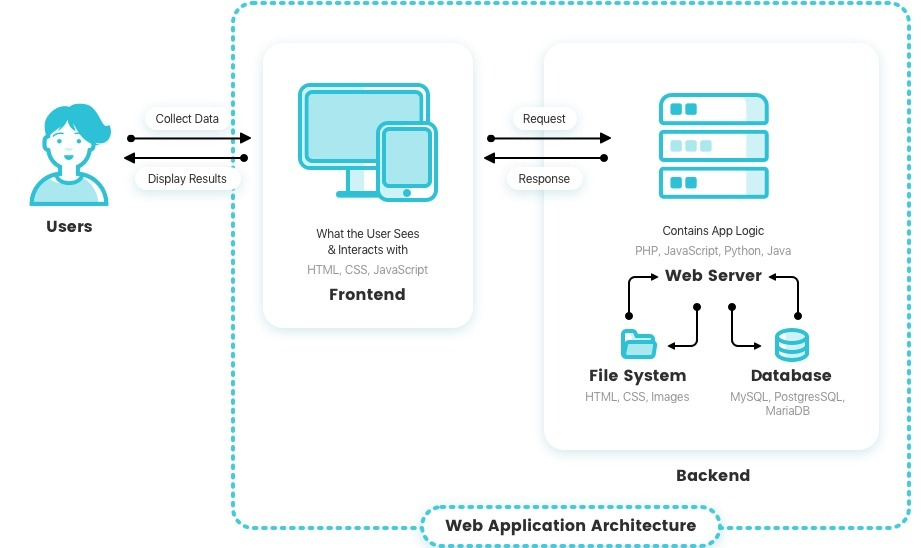

<style>
    /* Adds total number of pages to footer */
    /* section::after {
        content: attr(data-marpit-pagination) ' / ' attr(data-marpit-pagination-total);
    } */
    img {
        display: block;
        margin: 0 auto;
    }

    section.reference p {
        font-size: 0.8rem;
        text-align: center;
    }
</style>

<!-- _paginate: false -->

# Special Topic: Web Development and Graphics

ENGR 103: Engineering Computation and Algorithmic Thinking

Alex Ulbrich

---
<!-- _class: reference -->

# Example: Terrain Generation in the Browser


<p><a href="https://terrain-synth.kenny.wtf/">Terrain Synth</a> by <a href="https://github.com/kenjinp">Kenneth Pirman</a>. You can also check out Kenny's <a href="https://world-synth.kenny.wtf/">World Synth</a>.</p>

---

# Programming Languages on the Web

- HTML (HyperText Markup Language) - meaning and structure
- CSS (Cascading Style Sheets) - presentation/rendering
- JS (JavaScript), TS (TypeScript) - scripting
- And many libraries, frameworks, etc. (this evolves fast)

Your (web) browser (Safari, Chrome, Firefox, ...) can make sense of HTML/CSS/JS.

You can use your browser's Dev Tools to see what the browser sees.

Check [learn web development](https://developer.mozilla.org/en-US/docs/Learn_web_development) on MDN to get started.

---

# `index.html`

```html
<!DOCTYPE html>
<html lang="en">
    <head>
        <meta charset="utf-8">
        <meta name="viewport" content="width=device-width">
        <title>Hello World</title>
    </head>
    <body> 
        <h1>Hello World</h1>
        <p> 
            Alex was here.
        </p>
    </body>
</html>
```
<!-- DOCTYPE is preamble, lang and charset are attributes, head is container for non-visible things, body is container for all user visible things, meta is for metadata elements that cannot be represented by other tags like style, title, script, or link -->

---

# CSS

Wrap the following code in a `<style>` tag in the `<head>`.

```css
body {
    font-family: sans-serif;
    background-color: #f4f4f4;
}
h1 {
    color: #ea580c;
    text-align: center;
}
p {
    color: #333;
    text-align: center;
}
```

---

# JavaScript

Wrap the following code in a `<script>` tag in the `<head>`.

```js
let clickCount = 0;
            
function incrementCounter() {
    clickCount++;
    
    const paragraph = document.getElementById('placeholder');
    paragraph.textContent = `You clicked the button ${clickCount} time(s)`;
}
```

And change the HTML in the `<body>`.

```html
<p id="placeholder"> Alex was here. </p>
<button onclick="incrementCounter()">Click me</button>
```

---
<!-- _class: reference -->

# A Simplified View of the Web


<p><a href="https://www.intellectsoft.net/blog/wp-content/uploads/web-app-architecture-scheme.jpeg">Source</a></p>

---

# CPU and Clock Speed

The **Central Processing Unit (CPU)** is the chip in your computer that executes instructions to run programs.

The **clock speed** measures the number of cycles your CPU executes per second, measured in GHz (gigahertz) -- billions operations per second.

The relationship between clock speed and power consumption is not linear as it depends on the voltage, i.e., ...

---

# GPU

---

# Layers

---

# Libraries

--- 

# Exercise

---
