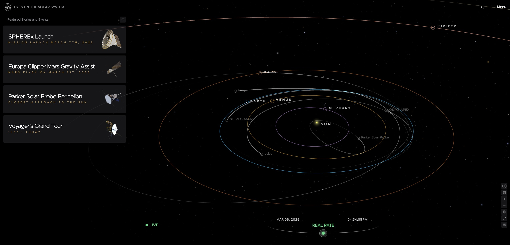
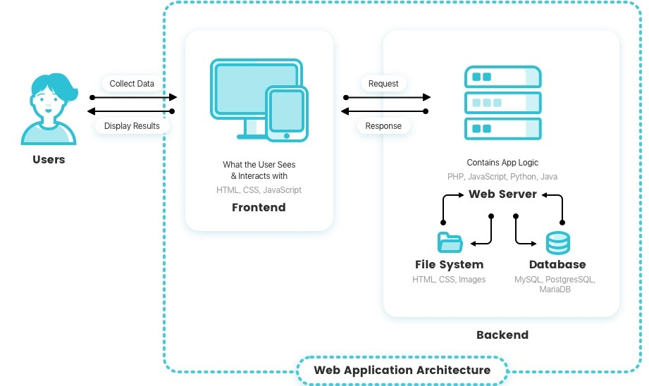
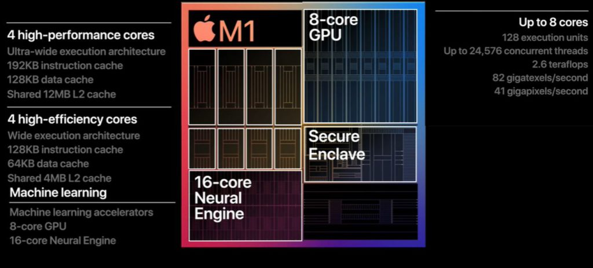
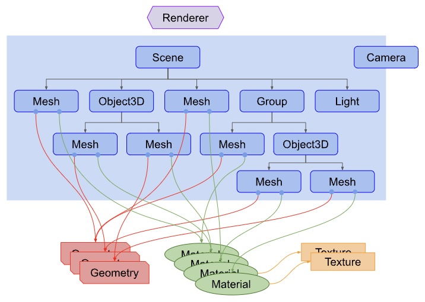
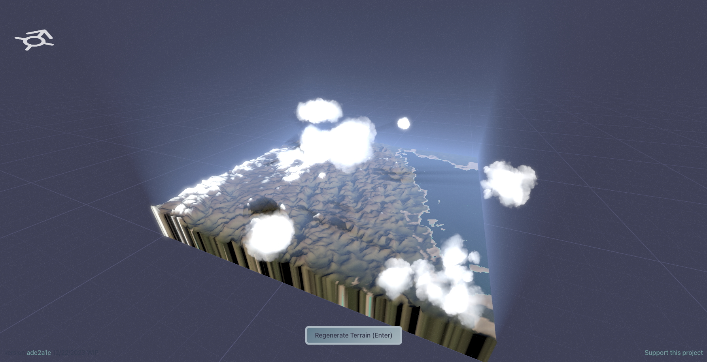
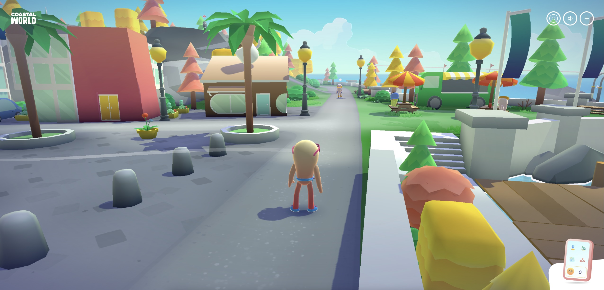

<style>
    /* Adds total number of pages to footer */
    /* section::after {
        content: attr(data-marpit-pagination) ' / ' attr(data-marpit-pagination-total);
    } */
    img {
        display: block;
        margin: 0 auto;
    }

    section.reference p {
        font-size: 0.8rem;
        text-align: center;
    }
</style>

<!-- _paginate: false -->

# Special Topic: Web Development and Graphics

ENGR 103: Engineering Computation and Algorithmic Thinking

Alex Ulbrich

---

# Today's Lecture

- Introduce programming languages for the browser
- Write a "Hello, World" web page
- Discuss CPUs and GPUs
- Explain a traditional "graphics" pipeline
- Graphics in the browser (Three.js and WebGL)
- Can we make a 3D rotating cube?

---

<!-- _class: reference -->

# Example: Exploring the Solar System in Real-Time


<p><a href="https://eyes.nasa.gov/apps/solar-system/">Eyes on the Solar System</a> by NASA</p>

---

# Programming Languages in the Browser

- HTML (HyperText Markup Language) - meaning and structure
- CSS (Cascading Style Sheets) - presentation/rendering
- JS (JavaScript), TS (TypeScript) - scripting
- And many libraries, frameworks, etc. (this evolves fast)

Your (web) browser (Safari, Chrome, Firefox, ...) can make sense of HTML/CSS/JS.

You can use your browser's Dev Tools to see what the browser sees.

Check [learn web development](https://developer.mozilla.org/en-US/docs/Learn_web_development) on MDN to get started.

<!-- Think of building a house. HTML is the structure — the walls, floors, and rooms. CSS is the interior design: paint, furniture, layout. JavaScript is the plumbing and electricity — it makes things actually work and respond. Every website you've ever used is some combination of these three. TypeScript is just JavaScript with stricter rules, which becomes useful in large teams. The browser is the runtime — it reads these files and turns them into what you see. -->

<!-- There are also a lot of common "backend" languages such as PHP, Python, Node.js, Ruby, Java, Go, etc. Pretty much any languages can be use for the backend, even C and C++! -->

---

# `index.html`

```html
<!DOCTYPE html>
<html lang="en">
    <head>
        <meta charset="utf-8">
        <meta name="viewport" content="width=device-width">
        <title>Hello World</title>
    </head>
    <body> 
        <h1>Hello World</h1>
        <p> 
            Alex was here.
        </p>
    </body>
</html>
```
<!-- DOCTYPE is preamble, lang and charset are attributes, head is container for non-visible things, body is container for all user visible things, meta is for metadata elements that cannot be represented by other tags like style, title, script, or link -->

---

# CSS

Wrap the following code in a `<style>` tag in the `<head>`.

```css
body {
    font-family: sans-serif;
    background-color: #f4f4f4;
}
h1 {
    color: #ea580c;
    text-align: center;
}
p {
    color: #333;
    text-align: center;
}
```

<!-- CSS works by targeting elements — h1 { color: orange } means 'find every h1 on the page and make it orange.' The curly braces hold a list of property-value pairs. background-color: #f4f4f4 is a hex color — that's a light gray. Notice how CSS doesn't tell the browser what something is, only how it looks. That separation of concerns (structure vs. presentation) is a deliberate design choice. -->

---

# JavaScript (JS)

Wrap the following code in a `<script>` tag in the `<head>`.

```js
let clickCount = 0;
            
function incrementCounter() {
    clickCount++;
    
    const paragraph = document.getElementById('placeholder');
    paragraph.textContent = `You clicked the button ${clickCount} time(s)`;
}
```

<!-- clickCount is a global variable, dynamically typed -->
<!-- document is a global object provided by the browser, returns an object/null -->
<!-- const binds paragraph to the specific element in the document, that link cannot be changed, but the value of the element in the document can change -->
<!-- paragraph is hence an object and textContent a varibale in that object -->
<!-- backticks create a template literal -->

And change the HTML in the `<body>`.

```html
<p id="placeholder"> Alex was here. </p>
<button onclick="incrementCounter()">Click me</button>
```

<!-- Placing the script in the head without a defer attribute is not recommended. Many modern approaches have scripts manipulate the DOM at load time, hence it should be loaded after the page body. -->

---
<!-- _class: reference -->

# A Simplified View of the Web


<p><a href="https://www.intellectsoft.net/blog/wp-content/uploads/web-app-architecture-scheme.jpeg">Source</a></p>

---

# CPU and Clock Speed

The **Central Processing Unit (CPU)** is the chip in your computer that executes instructions to run programs. It is designed for *general-purpose computing*.

The **clock speed** measures the number of cycles your CPU executes per second, measured in GHz (gigahertz) -- billions clock cycles per second.

The relationship between clock speed and power consumption is not linear as it depends on the voltage to the power of 2. **More power also means more heat...**

Example

- At 1 GHz CPU might use 20W at 1.0V.
- At 2 GHz, if voltage rises from 1.0V to 1.1V, power could jump to ~48W (2 × 1.1² × 20W), showing how both frequency and voltage hikes compound.

<!-- The power formula is P ∝ V² × f — power scales linearly with frequency but quadratically with voltage. The problem is that pushing frequency higher usually demands higher voltage too, so the costs multiply. At some point you're generating more heat than you can cool, which is exactly why around 2005, CPU makers stopped racing for raw clock speed and started adding more cores instead. -->

<!-- The relationship between power, frequency, and voltage depends on the architecture. -->
<!-- Example: An Intel Core i9-13900K has 8 performance cores, each capable of running a full program independently with deep instruction pipelines. -->
<!-- Analogy: A skilled chef who can cook an entire gourmet meal alone—versatile but limited to one dish at a time. -->
<!-- Modern CPUs execute multiple operations per cycle (IPC > 1). -->

---

# Parallelization

Could we scale the clock speed differently?

Instead of increasing the clock speed of **one core**, can we have **multiple** cores working **simultaneously**?

2x cores = 2x speed ≈ 2x power consumption (there is a little overhead)

Lots of tasks cannot be broken down to execute in **parallel**, they have to be done **sequentially** (in particular, if there are dependencies between operations).

Other tasks are a great fit, such as... **graphics rendering** (and also machine learning, data processing, all kinds of simulations, crypto mining, ...)

<!-- Some problems are embarrassingly parallel: every piece of work is independent. Coloring every pixel on your screen is like that: pixel 1 doesn't need to wait for pixel 2. Other problems are inherently sequential: you can't compute step 3 until step 2 is done, like evaluating a chain of if statements. Graphics is almost entirely the first kind, which is why it maps perfectly onto parallel hardware. -->

<!-- We might be able to parallelize `for` loops for example, but not anything conditional. -->

---

# Graphics Processing Unit (GPU)

Increase the number of cores but have them run at a **lower** frequency and *optimized for data-parallel tasks*. One core can't run a whole program by itself.



<!-- If a CPU core is a master chef — highly skilled, can do anything, one dish at a time — a GPU core is a line cook in a massive fast-food kitchen. Each one is simple and specialized, but you have thousands of them working simultaneously. An Apple M1 has 8 CPU cores and 8 GPU cores on the same chip. An NVIDIA RTX 4090 has over 16,000 shader cores. Each shader core isn't doing anything complicated — it's running a tiny math program called a shader, the same program, on thousands of pixels at once.. -->

---

# How Do We Get to Display Things on the Screen?

1. **Application**: "Draw a 3D scene" → CPU prepares data
2. **Graphics Engine**: Organizes scene into renderable chunks
3. **Graphics API**: Application issues draw commands through API
4. **Driver**: Translates API commands to GPU instructions → GPU executes pipeline (vertex shading → rasterization → fragment shading → framebuffer)
5. **OS / Compositor**: Display driver model schedules the framebuffer flip; compositor blends application surfaces → final image
6. **Display Interface**: GPU's display engine streams the final framebuffer over HDMI/DisplayPort to the screen

Read more about the [graphics pipeline](https://en.wikipedia.org/wiki/Graphics_pipeline), or transforming a 3D scene into a 2D representation on your screen.

<!-- flip = swap which buffer the monitor is reading from -->
<!-- Applications: browser, game, modeling tool, using C++, Python, ... -->
<!-- Graphics Engine: Unreal, Unity, Godot, ... -->
<!-- Graphics API: DirectX, Vulkan, Metal, OpenGL, WebGL -->
<!-- Driver: Vendor-specific, i.e., NVIDIA, AMD, Intel, ... -->
<!-- OS and Compositor: Windows Display Driver Model, Wayland, X11, ...-->

<!-- 
  1. Your application — say a game — decides what the 3D world looks like. The CPU computes physics, AI, player
  position.
  2. The graphics engine — Unity, Unreal, Godot — takes that scene and decides what's actually visible. It culls
  objects behind walls, sorts by distance, picks which shaders to use.
  3. It then issues draw commands through a Graphics API. The API is just a standardized interface — think of it
  like calling a function: 'draw these triangles with this shader.'
  4. The driver — written by NVIDIA or AMD for your specific card — translates those API calls into actual machine
  code the GPU understands. The GPU then runs its pipeline: first it transforms all the triangle vertices into
  screen coordinates (vertex shading), then it figures out which pixels are covered by which triangles
  (rasterization), then it runs a per-pixel program to determine color, lighting, and shadows (fragment shading).
  The result is a framebuffer — a grid of pixel colors in memory.
  5. The OS display stack — on Windows that's WDDM and DWM — schedules when that framebuffer gets flipped to screen
  and composites your app's window with everything else: the taskbar, other windows, the cursor.
  6. Finally, the GPU's display engine — a dedicated circuit separate from the render cores — streams that composed
  image out over HDMI or DisplayPort to your monitor at 60 or 144 times per second. 
-->

---

# Example

1. **Game (CPU)**: Calculates player position, sends mesh data.
2. **Unity (CPU)**: Culls unseen objects, prepares shaders.
3. **DirectX 11 (CPU)**: Builds a command list.
4. **NVIDIA Driver (CPU/GPU)**: Converts commands to Ampere instructions → GPU renders 8M pixels in parallel.
5. **Windows (CPU/GPU)**: WDDM flips the framebuffer, DWM composites with taskbar.
6. **DisplayPort (GPU)**: Sends 4K@60Hz pixel stream to monitor.
7. **Screen**: Displays the frame in ~16ms.

<!-- "WDDM" stands for Windows Display Driver Model and "DWM" stands for Desktop Window Manager. -->

---

# In Practice

Drivers are proprietary and very low-level, they change depending on your hardware.

Graphics API are a little better but are still low-level, and *might* change based on your operating system (e.g., DirectX is only for Microsoft, Metal for Apple platforms).

A graphics engine is often a full-featured, self-contained platform. It does a lot of things in addition to "just" rendering.

What if we want something a little more lightweight, a little more accessible? Something we could use on the web.

<!-- If you wanted to write a game from scratch, you'd need to deal with all of this. Drivers are written in C++ and tied to specific hardware. Graphics APIs like Vulkan or Metal are powerful but notoriously complex — writing a triangle in Vulkan takes hundreds of lines of code. A full engine like Unreal handles all of that but is itself a massive system. For a web developer, none of that is accessible... unless we use WebGL and Three.js. -->

---

# Three.js

A web library that wraps WebGL (the API), offering a higher-level abstraction.



<!-- Three.js sits on top of WebGL — which is essentially OpenGL running inside your browser tab. WebGL gives you the raw GPU pipeline; Three.js gives you objects to work with: Scene, Camera, Mesh, Light. Instead of writing GLSL shader code and managing GPU buffers manually, you write JavaScript. The diagram shows exactly that layering: your Three.js code → WebGL API → browser/GPU driver → GPU hardware. -->

---

# What Would We Need to Display a 3D Rotating Cube in our Browser?

- A new `<canvas>` element in our HTML for WebGL to draw graphics and animations
- Importing the Three.js library in our HTML page with JavaScript (JS)
- Write a JS Script:
  - Create a Scene and a Camera
  - Add a Cube to the Scene
  - Animate the Cube
  - ...

All the code from this lecture is [available on GitHub](https://github.com/adulbrich/engr103-special-topics/tree/main/web-and-graphics).

---

<!-- _class: reference -->

# Example: Docking with the ISS


<p><a href="https://iss-sim.spacex.com/">ISS Docking Simulator</a> by SpaceX</p>

---
<!-- _class: reference -->

# Example: Terrain Generation in the Browser


<p><a href="https://terrain-synth.kenny.wtf/">Terrain Synth</a> by <a href="https://github.com/kenjinp">Kenneth Pirman</a>. You can also check out Kenny's <a href="https://world-synth.kenny.wtf/">World Synth</a>.</p>

---

<!-- _class: reference -->

# Example: Learn About Digital Banking Solutions



<p><a href="https://coastalworld.com/">Coast World</a> by Coastal Community Bank</p>
