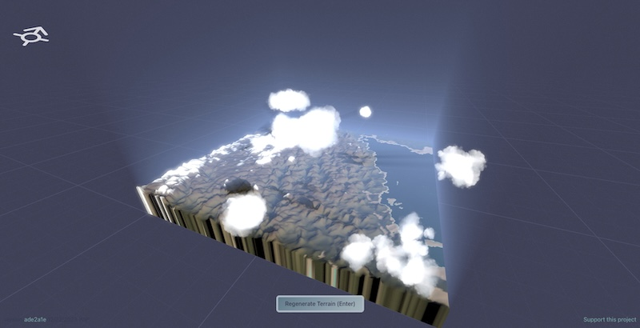

<style>
    /* Adds total number of pages to footer */
    /* section::after {
        content: attr(data-marpit-pagination) ' / ' attr(data-marpit-pagination-total);
    } */
    img {
        display: block;
        margin: 0 auto;
    }

    section.reference p {
        font-size: 0.8rem;
        text-align: center;
    }
</style>

<!-- _paginate: false -->

# Special Topic: Web Development and Graphics

ENGR 103: Engineering Computation and Algorithmic Thinking

Alex Ulbrich

---

# Today's Lecture

- Introduce programming languages for the browser
- Write a "Hello, World" web page
- Discuss CPUs and GPUs
- Explain a traditional "graphics" pipeline
- Graphics in the browser (Three.js and WebGL)
- Can we make a 3D rotating cube?

---
<!-- _class: reference -->

# Example: Terrain Generation in the Browser


<p><a href="https://terrain-synth.kenny.wtf/">Terrain Synth</a> by <a href="https://github.com/kenjinp">Kenneth Pirman</a>. You can also check out Kenny's <a href="https://world-synth.kenny.wtf/">World Synth</a>.</p>

---

# Programming Languages in the Browser

- HTML (HyperText Markup Language) - meaning and structure
- CSS (Cascading Style Sheets) - presentation/rendering
- JS (JavaScript), TS (TypeScript) - scripting
- And many libraries, frameworks, etc. (this evolves fast)

Your (web) browser (Safari, Chrome, Firefox, ...) can make sense of HTML/CSS/JS.

You can use your browser's Dev Tools to see what the browser sees.

Check [learn web development](https://developer.mozilla.org/en-US/docs/Learn_web_development) on MDN to get started.

<!-- There are also a lot of common "backend" languages such as PHP, Python, Node.js, Ruby, Java, Go, etc. Pretty much any languages can be use for the backend, even C and C++! -->

---

# `index.html`

```html
<!DOCTYPE html>
<html lang="en">
    <head>
        <meta charset="utf-8">
        <meta name="viewport" content="width=device-width">
        <title>Hello World</title>
    </head>
    <body> 
        <h1>Hello World</h1>
        <p> 
            Alex was here.
        </p>
    </body>
</html>
```
<!-- DOCTYPE is preamble, lang and charset are attributes, head is container for non-visible things, body is container for all user visible things, meta is for metadata elements that cannot be represented by other tags like style, title, script, or link -->

---

# CSS

Wrap the following code in a `<style>` tag in the `<head>`.

```css
body {
    font-family: sans-serif;
    background-color: #f4f4f4;
}
h1 {
    color: #ea580c;
    text-align: center;
}
p {
    color: #333;
    text-align: center;
}
```

---

# JavaScript (JS)

Wrap the following code in a `<script>` tag in the `<head>`.

```js
let clickCount = 0;
            
function incrementCounter() {
    clickCount++;
    
    const paragraph = document.getElementById('placeholder');
    paragraph.textContent = `You clicked the button ${clickCount} time(s)`;
}
```

And change the HTML in the `<body>`.

```html
<p id="placeholder"> Alex was here. </p>
<button onclick="incrementCounter()">Click me</button>
```

---
<!-- _class: reference -->

# A Simplified View of the Web


<p><a href="https://www.intellectsoft.net/blog/wp-content/uploads/web-app-architecture-scheme.jpeg">Source</a></p>

---

# CPU and Clock Speed

The **Central Processing Unit (CPU)** is the chip in your computer that executes instructions to run programs. It is designed for *general-purpose computing*.

The **clock speed** measures the number of cycles your CPU executes per second, measured in GHz (gigahertz) -- billions operations per second.

The relationship between clock speed and power consumption is not linear as it depends on the voltage to the power of 2. **More power also means more heat...**

Example

- At 1 GHz CPU might use 20W at 1.0V.
- At 2 GHz, if voltage rises from 1.0V to 1.1V, power could jump to ~48W (2 × 1.1² × 20W), showing how both frequency and voltage hikes compound.

<!-- The relationship between power, frequency, and voltage depends on the architecture. -->
<!-- Example: An Intel Core i9-13900K has 8 performance cores, each capable of running a full program independently with deep instruction pipelines. -->
<!-- Analogy: A skilled chef who can cook an entire gourmet meal alone—versatile but limited to one dish at a time. -->

---

# Parallelization

Could we scale the clock speed differently?

Instead of increasing the clock speed of **one core**, can we have **multiple** cores working **simultaneously**?

2x cores = 2x speed ≈ 2x power consumption (there is a little overhead)

Lots of tasks cannot be broken down to execute in **parallel**, they have to be done **sequentially** (in particular, if there are dependencies between operations).

Other tasks are a great fit, such as... **graphics rendering** (and also machine learning, data processing, all kinds of simulations, crypto mining, ...)

<!-- We might be able to parallelize `for` loops for example, but not anything conditional. -->

---

# Graphics Processing Unit (GPU)

Increase the number of cores but have them run at a **lower** frequency and *optimized for data-parallel tasks*. One core can't run a whole program by itself.


<!-- Example: An NVIDIA RTX 4090 has 16,384 CUDA cores, but each one is a tiny ALU (Arithmetic Logic Unit), not a full processor—collectively, they churn through teraflops of parallel compute. -->
<!-- Analogy: A fast-food worker flipping burgers—each does one simple task, but thousands together can serve a crowd instantly. -->

---

# How to We Get to Display Things on the Screen?

1. **Application**: "Draw a 3D scene" → CPU prepares data
2. **Graphics Engine**: Organizes scene into renderable chunks
3. **Graphics API**: Issues draw commands (e.g., "render triangles")
4. **Driver**: Translates API commands to GPU instructions → GPU executes pipeline (vertex → fragment → framebuffer)
5. **Operating System**: Manages resources and queues framebuffer for display
6. **Compositor**: Blends GPU output with UI → final image
7. **Display Interface**: GPU sends pixels to screen hardware

Read more about the [graphics pipeline](https://en.wikipedia.org/wiki/Graphics_pipeline), or transforming a 3D scene into a 2D representation on your screen.

<!-- Applications: browser, game, modeling tool, using C++, Python, ... -->
<!-- Graphics Engine: Unreal, Unity, Godot, ... -->
<!-- Graphics API: DirectX, Vulkan, Metal, OpenGL, WebGL -->
<!-- Driver: Vendor-specific, i.e., NVIDIA, AMD, Intel, ... -->
<!-- OS and Compositor: Windows Display Driver Model, Wayland, X11, ...-->

---

# Example

1. **Game (CPU)**: Calculates player position, sends mesh data.
2. **Unity (CPU)**: Culls unseen objects, prepares shaders.
3. **DirectX 11 (CPU)**: Builds a command list.
4. **NVIDIA Driver (CPU/GPU)**: Converts commands to Ampere instructions → GPU renders 8M pixels in parallel.
5. **Windows (CPU/GPU)**: WDDM flips the framebuffer, DWM composites with taskbar.
6. **DisplayPort (GPU)**: Sends 4K@60Hz pixel stream to monitor.
7. **Screen**: Displays the frame in ~16ms.

<!-- "WDDM" stands for Windows Display Driver Model and "DWM" stands for Desktop Window Manager. -->

---

# In Practice

Drivers are proprietary and very low-level, they change depending on your hardware.

Graphics API are a little better but are still low-level, and *might* change based on your operating system (e.g., DirectX is only for Microsoft, Metal for MacOS).

A graphics engine is often a full-featured, self-contained platform. It does a lot of things in addition to "just" rendering.

What if we want something a little more lightweight, a little more accessible? Something we could use on the web.

---

# Three.js

A web library that wraps WebGL (the API), offering a higher-level abstraction.


---

# What Would We Need to Display a 3D Rotating Cube in our Browser?

- A new `<canvas>` element in our HTML for WebGL to draw graphics and animations
- Importing the Three.js library in our HTML page with JavaScript (JS)
- Write a JS Script:
  - Create a Scene and a Camera
  - Add a Cube to the Scene
  - Animate the Cube
  - ...

All the code from this lecture is [available on GitHub](https://github.com/adulbrich/engr103-special-topics/tree/main/web-and-graphics).

---

<!-- _class: reference -->

# Example: Docking with the ISS


<p><a href="https://iss-sim.spacex.com/">ISS Docking Simulator</a> by SpaceX</p>


---

<!-- _class: reference -->

# Example: Exploring the Solar System in Real-Time


<p><a href="https://eyes.nasa.gov/apps/solar-system/">Eyes on the Solar System</a> by NASA</p>

---

<!-- _class: reference -->

# Example: Learn About Digital Banking Solutions


<p><a href="https://coastalworld.com/">Coast World</a> by Coastal Community Bank</p>
