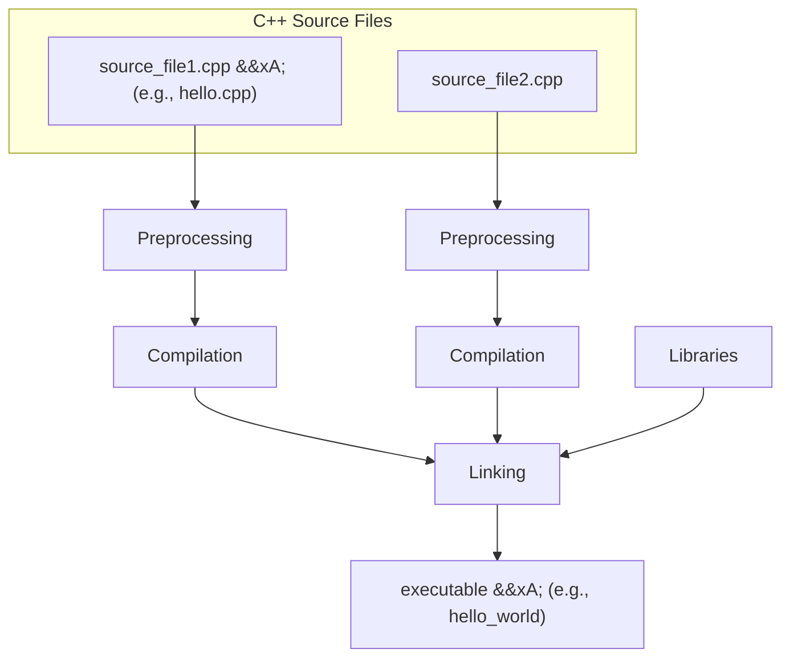

In this lecture, you'll a C++ program and learn what actually happens when you “run” it. We'll start with what programming languages are and how computers interpret them, then look at the two main kinds of translator programs (interpreters and compilers). Finally, we'll connect that to the C++ build pipeline (preprocess → compile → link), common types of errors, and a careful walkthrough of a simple “Hello, World!” program.

## Languages and Programming

Languages are fundamental to human communication, enabling us to convey ideas, emotions, and instructions. In the realm of computing, languages serve a similar purpose, allowing us to communicate with machines and instruct them to perform specific tasks. Understanding the basic concepts of languages is crucial for anyone delving into the field of computer science and programming.

To grasp the essence of programming languages, it's important to understand the following key concepts:

1. **Sentence**: A sequence of symbols with semantic interpretation (meaning). In both spoken and programming languages, sentences convey complete thoughts or instructions.
2. **Syntax**: Rules that dictate how symbols can form sentences. Syntax ensures that sentences are structured correctly, much like grammar rules in spoken languages.
3. **Semantics**: describe how a sentence should be interpreted. They provide meaning to sentences, ensuring that they convey the intended message.
4. **Grammar**: Combination of syntax and semantics, describing valid sentences and their meanings. Grammar provides a framework for constructing meaningful and correct sentences.
5. **Language**: A set of valid sentences derived from a grammar. In computing, a language is a system of communication used to write programs that a computer can execute.

These principles apply to both spoken languages and programming languages. A **programming language** is used to express instructions for a computer to interpret and execute. Just as we use different spoken languages for various contexts and purposes, there are numerous programming languages, each with its own strengths and applications.

In this course, we use **C++**, a versatile language popular in software engineering, game development, and computer graphics. 

:::note[The Story of C++]
In the early 1970s, Dennis Ritchie created C at Bell Labs. His goal? To develop a powerful, efficient language for writing system software, like operating systems. In fact, the Unix operating system—the backbone of modern computing—was written in C, making it one of the most influential programming languages in history.

Fast forward to the 1980s. A Danish computer scientist named Bjarne Stroustrup was working on his Ph.D. at Cambridge University and later joined Bell Labs. Stroustrup loved C for its efficiency but found it lacking in tools for organizing complex software—especially in large projects. Inspired by the object-oriented programming (OOP) concepts in a language called Simula, he decided to build on C's strengths by adding objects, classes, and other high-level features. The result? C with Classes, which he later renamed C++ in 1983.

The name “C++” is a playful nod to the programming world. In C, the ++ operator means “increment by one.” So, “C++” represents an incremental improvement over C—a clever way to signal that it builds upon the original language.

C++ is still actively maintained and improved. Major updates, like C++11, C++17, and C++20, have added modern features while staying true to its roots. It's a language that has stood the test of time, evolving to meet the demands of modern computing.
:::

A set of instructions written in a programming language is called a program or software application. Programs power almost everything on a computer—from browsers (e.g., Chrome, Firefox) and tools (e.g., Notepad, Microsoft Word) to entire operating systems (e.g., Windows, macOS, Linux).

:::note[Did You Know?]
The visual effects in Pixar movies, like Toy Story and Finding Nemo, were powered by software written in C++. And many popular video games, like The Sims and Counter-Strike, use C++ for their graphics and physics engines. C++ has shaped industries and powered some of the most iconic creations in entertainment.
:::

We will focus on terminal-based programs processing textual inputs and outputs. These programs are fundamental to understanding how computers interpret and execute instructions, providing a solid foundation for more advanced topics in computer science.

## Translators

In the realm of computing, humans write programs in **high-level** programming languages that are easier to understand and use. However, computers can only execute instructions written in their native machine language, which consists of binary code. To bridge this gap, we use translator programs that convert high-level language code into machine language.

### Machine Language

Computers understand only their machine language, which is a **low-level** language consisting of binary operation codes specific to a Central Processing Unit (CPU). Machine language is difficult for humans to read and write due to its complexity and lack of abstraction.

:::note[What are the Components of a Computer?]
A computer consists of several key components that work together to process data and execute programs:

- **Central Processing Unit (CPU)**: The brain of the computer that performs calculations and executes instructions.
- **Random Access Memory (RAM)**: Temporary storage that holds data and instructions while the computer is running.
- **Storage Devices**: Permanent storage for data and programs, such as hard drives (HDDs) or solid-state drives (SSDs).
- **Motherboard**: The main circuit board that connects all components of the computer.
- **Graphics Processing Unit (GPU)**: Specialized processor for rendering images and videos, often used in gaming and graphic design.

There are many other components (such as input and output devices, power supply, etc.), but these are the most relevant for understanding how programs are executed.
:::

:::note[Why Not Just Write in Machine Language?]
It would be very difficult to write meaningful software using such a primitive language. To make matters worse, different CPUs have different machine languages, so your program wouldn't even be portable.
:::

### Translator Programs

**Translator programs** are essential tools that convert high-level programming languages into machine language. There are two main types of translators:

1. **Interpreters**: Interpreters translate and execute instructions line-by-line, on-the-fly. This means that the program is read, translated, and executed simultaneously. Interpreters are useful for scripting languages and development environments where immediate feedback is beneficial, such as [Python](https://www.python.org/), JavaScript, [Ruby](https://www.ruby-lang.org/en/), Shell, or [Perl](https://www.perl.org/).
2. **Compilers**: Compilers translate entire programs into machine language before execution. The source code is converted into an executable file, which can then be run independently of the source code. Compilers are typically used for languages that require high performance and efficiency, such as C++, [Go](https://go.dev/), [Rust](https://www.rust-lang.org/), [Swift](https://www.swift.org/), or [Zig](https://ziglang.org/).

:::note[Hybrid Approaches?]
The reality is a little less clear-cut. Most programming languages tend to lean toward one translation style or another, but any kind of translator
can be built for any programming language. In particular, you can have a hybrid approach where a program is first compiled into an intermediate form (bytecode) and then interpreted in a runtime environment or virtual machine. This is the approach taken by languages like Java (with the Java Virtual Machine), C#, Python (with the CPython implementation), and even JavaScript. This allows high portability across platforms, while still providing some of the performance benefits of compilation. Hybrid translators are more complex and a bit slower than pure compilers.
:::

In this course, we'll use the **g++ compiler** to translate C++ code into machine language. This approach allows us to create efficient, executable programs tailored to the platform.

### Tradeoffs

Each type of translator has its own advantages and disadvantages:

- **Interpreted Programs**: Easier to debug and test since they provide immediate feedback. However, they tend to be slower because the translation happens at runtime.
- **Compiled Programs**: Generally faster and more efficient since the translation is done beforehand. However, they can be less portable because the compiled code is specific to a particular machine architecture.

Understanding the role of translators is crucial for programmers, as it influences the choice of programming languages and development tools based on the requirements of the project.

## Errors

Errors are an inevitable part of programming. Understanding the different types of errors and how to handle them is crucial for developing robust and reliable software. Errors can be broadly categorized into three types: syntax errors, runtime errors, and logic errors.

### Syntax Errors

These errors occur when the code violates the syntax rules of the programming language. Syntax errors are typically caught by static analysis tools such as compilers before the program is run. They prevent the program from compiling, meaning the code cannot be executed until the errors are fixed.

**Example:** Missing a semicolon at the end of a statement in C++.

Use compiler error messages to identify and correct syntax mistakes.

### Runtime Errors

These errors occur while the program is running and can cause the program to crash or behave unexpectedly. Runtime errors are detected during the execution of the program. They can cause the program to terminate unexpectedly or produce incorrect results.

**Example:** Division by zero or accessing an array out of bounds.

Implement error handling mechanisms such as try-catch blocks to gracefully handle runtime exceptions.

### Logic Errors

These errors occur when the program's logic is flawed, leading to incorrect results. Logic errors are the hardest to detect because the program runs without crashing but produces incorrect or unintended results. They can lead to subtle bugs that are difficult to trace and fix.

**Example:** Using the wrong formula to calculate a value.

Use debugging tools and techniques such as breakpoints and step-by-step execution to trace and fix logical flaws in the code.

## C++ Build Pipeline

To write a C++ program, you start by creating a file with a `.cpp` extension, such as `hello.cpp`. This file contains your source code, which you can edit using a text editor (e.g., vim). For example:

```cpp
// hello.cpp
#include <iostream>
int main() 
{
    std::cout << "Hello, World!" << std::endl;
}
```

This is a valid C++ program, but computers cannot execute C++ directly—they understand only machine language. To run your program, you need to translate your source code into a machine language executable. This process involves several steps, collectively called the build pipeline:

1. **Preprocessing:** Processes lines starting with `#` (preprocessor directives), modifying the source code before compilation.
2. **Compilation:** Translates the preprocessed C++ source code into object code (machine language files). Each `.cpp` file is compiled independently.
3. **Linking:** Combines object code from all `.cpp` files and libraries (e.g., `<iostream>`) into a single executable file.

Using the g++ compiler, you can automate these steps with a single command:

```bash title="g++ Build Command Syntax"
g++ -o <executable_name> <source_file1> <source_file2> ... <source_fileN>
```
where:
-	`<executable_name>` is the desired name of your executable, and
- `<source_fileX>` are the C++ source files to include.

For example, to build a single-file program `hello.cpp` into an executable named `hello_world`, run:

```bash title="g++ Build Command Example"
g++ -o hello_world hello.cpp
```



On UNIX-like systems (Linux/Mac), executables usually have no file extension, while on Windows, they typically use `.exe`. To run your executable, type its path in the terminal. For example:

```bash title="Running the Executable"
./hello_world
```

This will print `Hello, World!` to the terminal.

### Updating Your Program

If you update your source code (e.g., changing the output to `I love coding!!!`), you must rebuild the executable to reflect the changes:

```cpp 
// hello.cpp
#include <iostream>
int main() 
{
    std::cout << "I love coding!!!" << std::endl;
}
```

The existing executable does not automatically update. Run the `g++` command again to rebuild your program. If you forget to rebuild, your executable will still reflect the old version of your program, leading to confusion.

Your **source code** is the starting point for your program, but it is not the executable itself. Always rebuild your program after making changes to ensure your executable matches the latest version of your code.

## Dissecting Our “Hello, World!” Program

Let's break down the key components of our original C++ program:

```cpp
// hello.cpp
#include <iostream>
int main() 
{
    std::cout << "Hello, World!" << std::endl;
}
```

##### `#include <iostream>`

- A *preprocessor directive* instructing the compiler to insert the contents of the `iostream` header file from the C++ standard library before compilation. 
- Angle brackets `<>` denote a system header file, part of the C++ Standard Library. This library provides pre-written code for common tasks. `iostream` specifically provides tools for input/output (IO) streams, enabling interaction with the terminal (console). A stream is a channel for sending and receiving data.
- Without this line, attempting to use `std::cout` would result in a syntax error because it wouldn't be defined.

##### `int main() {}`

- Defines a **function** named `main`, the special entry point for any C++ program.
- The `int` indicates that the function returns an integer value (typically `0` to indicate successful execution).
- The `{}` enclose the function body, which contains the code executed when the program runs.
- The program's *control flow* starts at `main`. When the program is executed, the code inside `main` is executed sequentially.

##### `std::cout << "Hello, World!" << std::endl;`

- `std::cout` represents the standard output stream (connected to the terminal).
- `<<` is the stream insertion operator, used to send data into the output stream.
- `"Hello, World!"` is a string enclosed in double quotes, representing the text to output. Strings are sequences of characters. Omitting the quotes means treating the text as code, which would result in a syntax error.
- `std::endl` inserts a line break (like pressing Enter).
- `;` terminates the statement. C++ is not whitespace-sensitive; multiple spaces or line breaks between statements are generally ignored, but semicolons are essential.

Note that there is another stream insertion operator before `std::endl`, which appends the line break to the output. 

Multiple insertions can be chained: `std::cout << a << b << c;` is equivalent to:

```cpp title="Chained Stream Insertions"
std::cout << a; 
std::cout << b; 
std::cout << c;
```

--- 

If `#include <iostream>` is omitted, running `g++` would produce two errors:

```shell title="Compiler Errors Without iostream"
hello.cpp:2:3: error: use of undeclared identifier 'std'
    2 |   std::cout << "Hello, World!" << std::endl;
      |   ^
hello.cpp:2:35: error: use of undeclared identifier 'std'
    2 |   std::cout << "Hello, World!" << std::endl;
      |                                   ^
2 errors generated.
```

This indicates `std` is undefined because the `iostream` library was not included:

- `std` refers to the *standard namespace*, which organizes C++ standard library components. A namespace organizes code to avoid naming conflicts.
- `::` is the *scope resolution operator*, used to access tools like `cout` (console output) and `endl` within `std`.

--- 

We can modify the program , for example by adding another `std::cout` statement:

```diff lang="cpp" title="Modified Hello Program"
  #include <iostream>
  int main() 
  {
      std::cout << "I love coding!!!" << std::endl;
+     std::cout << "I love coding!!!" << std::endl;
  }
```

This produces:

```
I love coding!!!
I love coding!!!
```

If you omit `std::endl` in the first statement, the output will be:

```
I love coding!!!I love coding!!!
```

Without `std::endl`, output strings are printed on the same line, demonstrating the importance of line breaks for formatting.

:::note[Return Value of `main`]
You might notice that our `main` function is defined to return an `int`, but we didn't include a `return` statement. In C++, the `main` function is special: if execution reaches the end of `main` without encountering a return statement, it automatically returns `0`. A return value of `0` typically signals to the operating system that the program finished successfully.

However, it is considered good practice to include an explicit `return 0;` at the end of `main` to make the exit status clear and consistent with other functions that return values.

```cpp
// hello.cpp
int main() 
{
    std::cout << "Hello, World!" << std::endl;
    return 0;
}
```
:::