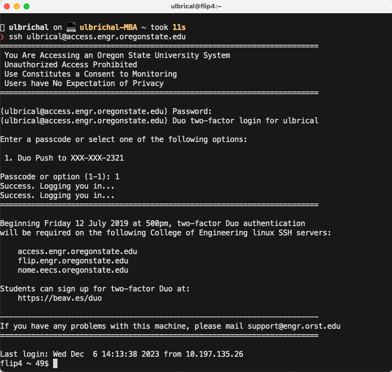

:::caution
You don't have to use the development tools discussed below for this class. Feel free to use whatever tools you'd like. However, maintaining a working development environment is your responsibility. The TAs and I can only offer guidance when you're using tools that we're familiar with, so it's recommended that you stick with the below tools unless you're already familiar with other ones that will accomplish the same tasks.
:::

## Terminals

A terminal is a program that lets us interface with our computer via textual commands that get interpreted by another internal program called a shell. All of the software we write in this class will be text-based.

That means that our programs will not create windows or tabs with graphical user interfaces. Instead, we will run our programs by issuing textual commands in a terminal, and they will output responses through text in the terminal as well. Indeed, it's difficult to write, build, and run basic software without some sort of terminal.

Luckily, all modern operating systems come with one or more terminals installed. Follow the instructions below based on your operating system to become acquainted with your terminal.

### Accessing and Configuring Your Terminal

#### Windows: Powershell or Windows Terminal

Windows actually offers a few terminals / shells. The oldest one is the Command shell (CMD). Most people consider it to be obsolete, so I don't recommend using it. The Command shell was superseded by Powershell—lots of people use this one.
To access Powershell, simply search for “Powershell” in the Windows start menu. When you start it, a window should appear with a text cursor. You can now begin issuing textual commands to your computer by typing them and pressing enter. We'll learn about some commands shortly.
When you open Powershell for the first time, it will default to a certain configuration that most people don't like, so you may want to do some reconfiguration. If you right click on the window's menu bar (the top of the window) and click “Properties”, you can configure your terminal to your liking (e.g., background colors, font colors, font sizes, etc).

#### macOS: Terminal

Mac comes with a terminal by default. It's simply called “Terminal”, and you can find it by typing “Terminal” into the Mac Spotlight search (the magnifying glass at the topright corner of your screen). When you open your Mac Terminal for the first time, it will default to a certain configuration that most people don't like, so you may want to do some reconfiguration. In the menu bar, navigate to Terminal → Preferences, then navigate to the Profiles tab. From here, you can add new terminal profiles and modify existing ones. A profile is basically just a configuration of terminal settings. For most cases, it's sufficient to just modify the default profile (e.g., “Basic”). You can change default font sizes, colors, etc.

#### UNIX/Linux

If you're running a UNIX/Linux OS other than macOS (e.g., Ubuntu, FreeBSD, etc), then you probably already know what a terminal is. Most *nix terminals are extremely similar since the default shell is configured at a user level, so use whatever terminal you want.

:::tip[Some Other Terminal Programs]
In no specific order:

- [Alacritty](https://alacritty.org/)
- [iTerm2](https://iterm2.com/)
- [Hyper](https://hyper.is/)
- [Warp](https://www.warp.dev/)
- [Terminus](https://termius.com/)
- [Tabby](https://tabby.sh/)

Consider a cross-shell prompt, such as [Starship](https://starship.rs/), [Oh My Posh](https://ohmyposh.dev/), or [Powerline](https://github.com/powerline/powerline) to make your shell environment look good across platforms.
:::

## ENGR Servers

In some sense, you can think of a terminal as being similar to the Windows File Explorer or Mac Finder, but everything is text-based. By issuing textual commands in your terminal (i.e., typing them and pressing enter), you can navigate your file system, view files, edit files, and execute files (if they're executable). Indeed, anything you can do in a file explorer, you can also do in a terminal. But there are also lots of things that you can do in a terminal that you can't do in a file explorer. For this reason, terminals are indispensable
tools when you need to interface with your computer in intricate ways, such as in software development. 

However, we're going to do things a little differently in this course. Rather than issuing commands to our computer via the terminal, we're primarily going to be issuing commands to a different computer. In particular, OSU's College of Engineering has some big, fancy computers in the Kelley Engineering Center's server room. I'll refer to these computers as the ENGR servers. For this course, we're going to be doing all of our work on the ENGR servers. But there's one issue—the ENGR servers don't have monitors, mice, or keyboards attached to them (not to mention, they're behind locked doors, and only certain faculty and
staff are allowed physical access). So... How do we use them?

Well, it's simple—we're going to issue a single command to our computer's terminal to instruct our computer to connect to the ENGR servers remotely. At that point, we will be able to control the ENGR servers via a remote shell (i.e., we will be able to type commands into our terminal to control the ENGR servers). Note that this requires internet access.

Of course, connecting to and controlling OSU's ENGR servers requires authentication. First, you have to create an ENGR account if you don't already have one. To do this, navigate to [CoE TEACH](https://teach.engr.oregonstate.edu/teach.php), click “Create a new account”, and follow the instructions on screen to create your ENGR account.

Once you have an ENGR account setup, you should be able to connect to the ENGR servers from your terminal. To do this, type the following command into your terminal and press enter, substituting `<ONID>` with your ONID (e.g., mine is `ulbrical`):

```sh
ssh <ONID>@access.engr.oregonstate.edu
```

`ssh` stands for “Secure Shell”. It is a cryptographic network protocol that lets you connect to and control another computer remotely with a predefined user account and associated permissions.

At this point, your terminal should prompt you for a password (if not, then there's likely something wrong with your internet connection, or perhaps the ENGR servers are temporarily down). Type in your ONID password and press enter (i.e., the password you use to login to OSU services, like Canvas and Outlook). **Note that your password will be invisible as you type it.** That's okay—it's an intended security feature.

Your terminal should now prompt you to verify your login via Duo. If you have multiple Duo devices, then it will ask you which duo device you'd like to use for authentication. Type the desired device number and press enter. Approve the Duo push via your device. You should now be logged into the ENGR servers.



The ENGR servers run Linux, which means any commands you type into your terminal from here on out will be interpreted by the ENGR servers as Linux shell commands. You can configure your user account's Linux shell on TEACH, but the default one will work just fine. In addition, it's important to understand that, since your terminal is now controlling the ENGR servers rather than your own computer, you are now operating on the ENGR filespace. Soon, we will learn how to create and edit files on the ENGR server—understand that these files will be located on the ENGR servers and cannot be accessed trivially from your computer / Windows File Explorer / Mac Finder (if you wanted to transfer files between your computer and the ENGR
servers, you'd have to use a file transfer protocol like SFTP or SCP; feel free to Google it).

Some terminology: When we say something is local, or done locally, it means that it occurs directly on your computer. When we say something is remote, or done remotely, it means that it occurs on the ENGR servers (or whatever server you're connected to).

## The Prompt

The prompt is essentially a marker for where you can type commands. It appears every time the shell is ready to accept input. A simple example of a default prompt might look like this:

```sh
user@hostname:~$
```

### Components

The prompt typically provides useful contextual information. Here's a breakdown of common elements.

- Username (`user`): indicates the user currently logged into the system.
- Hostname (`hostname`): shows the name of the computer or server you're connected to, it's helpful in identifying the machine when working on multiple systems.
- Current Working Directory: shows the directory you're currently in, `~` means it's your `/home` directory, but it can be specific, e.g. `/var/log`.
- Shell Account Type: `$` means you're' a normal user, while `#` indicates elevated permissions (superuser/root).

### Interactive Features

- Tab Completion
- Command History
- Aliases

## Shell Commands

Now that our terminal is connected to the ENGR servers, we should learn how to use it. To summarize, here is a table briefly describing some important Linux shell commands:

| Command | Description |
| ------- | ----------- |
| `ssh` | |
| `pwd` | |
| `ls` | |
| `mkdir` | |
| `cd` | |
| `clear` | |
| `cp` | |
| `mv` | |
| `rm` | |
| `cat` | |
| `vim <path>` | |

### Basic Structure

```sh
command [options] [arguments]
```

#### `command`

The name of the program or script or utility that you want to execute.

Example: `ls` the command to list directory contents.

#### `options` (flags)

Options modify the behavior of the command. They are usually optional.

They often start with a `-` (single dash) for short options or `--` (double dash) for long options.

Example: `ls -l --color`, where `-l` enables long-format listing and `--color` highlights file types and permissions with colors (default is always).

You can also combine short options such as `ls -lsh`, where `-s` prints the allocated size of each file, in blocks, and `-h` makes things human-readable (when combined with `-s`).

#### `arguments`

Inputs to the command, such as file names, directories, or specific data to operate on.

Example:

```sh
cat myfile.txt
``` 

where `myfile.txt` is the argument to the `cat` command, which concatenates file(s) to the standard output.

Commands can accept multiple arguments:

```sh
cp file1.txt file2.txt destination/
```

where `file1.txt` and `file2.txt` are source files, and `destination/` is the target directory.

#### Combining `options` and `arguments`

Options and arguments can be combined in various ways, depending on the command syntax.

```sh
tar -czf archive.tar.gz file1 file2
```

where `-czf` is a combination of options for creating (c), compressing (z), and specifying a file (f), `archive.tar.gz` is the argument specifying the output file, and `file1` and `file2` are the files to archive.

### Additional Concepts

#### Pipes

#### Redirection

#### Subcommands

#### Environment Variables

#### Command Order and Logic

#### Miscellaneous

`.` `..` etc.

## Text Editors: `vim`, `nano`

TBD

## Git

Imagine you've been working on a large program for weeks. You've completed 90% of the work, and everything seems to function properly. Only a few small changes remain. You make those changes, and… uh oh! Suddenly, everything breaks. With the deadline looming, you're left scrambling with nothing to deliver.

This scenario highlights how delicate code can be, especially if it isn't written robustly. To avoid such setbacks, it's essential to save frequent snapshots (backups) of both working and non-working versions of your code. This is where Version Control Systems (VCS) come in, and the most popular VCS is Git.

### What is Git?

Git allows you to save snapshots, called commits, of your code at any point in time. While it can handle any type of digital project, it's especially popular among software engineers. Git uses a space-efficient method called delta compression to store changes, making it ideal for tracking modifications between commits.

Git is a command-line utility, meaning you interact with it through a terminal. It's pre-installed on the ENGR servers, so you can use it there via SSH. You can also install Git on your personal computer.

### Configuring Git

Before using Git, you must configure some global settings, such as your name and email address. These are stored with every commit you create. To set them up, run the following commands, replacing `<your_name>` and `<your_email>` with your full name and email:

```bash
git config --global user.name "<your_name>"
git config --global user.email "<your_email>"
```

You can update these settings at any time, and they can also be overridden with project-specific settings.

### Understanding Repositories

Git works by tracking repositories (or repos), which are tagged directories containing your project files. There are two ways to create a Git repo:

1. **Clone a GitHub Repo**: Create a repo on a hosting platform like GitHub, then use the `git clone` command to copy it to your local filespace. This creates a directory tagged as a Git repo, containing all the files from the remote GitHub repo, and sets up synchronization between them.
2. **Initialize a Local Repo**: Use the `git init` command to tag an existing local directory as a Git repo. You can optionally configure this local repo to sync with a remote one, such as a GitHub repo.

For this course, we'll focus on the first method.

### Creating and Cloning a Repo on GitHub

To create a GitHub repo, follow the steps on the platform's web interface. After creating a repo (or accessing one from GitHub Classroom), you can clone it into your filespace using:

```bash
git clone <github-repo-ssh-url>
```

Replace `<github-repo-ssh-url>` with the repo's SSH URL, which can be found on its GitHub page by clicking the green Code button and selecting the SSH tab. Note: You need proper permissions to clone a repo. In Studio 2, you'll learn how to set up these permissions and authenticate with GitHub using SSH keys.

After cloning, run `ls` in your terminal to verify that a new directory matching the repo name appears in your working directory. Navigate into this directory with `cd`, and run `ls` again to see all the files from the GitHub repo.

### Working in a Git Repo

Once your working directory (or one of its parent directories) is tagged as a Git repo, you can use various Git commands. For example, to check the status of your repo, run:

```bash
git status
```

This command, along with all other Git commands, works only when your current working directory is part of a Git repo.

By following these steps, you'll be ready to use Git to manage your projects effectively and avoid last-minute surprises.

Suppose I've just cloned a repository containing a single file, main.cpp, with the following C++ source code:

```cpp 
// main.cpp
#include <iostream>
int main() {
  std::cout << "Hello, World!" << std::endl;
}
```

If I haven't modified this file or added any new files to the repository since cloning, running the command git status will produce output similar to this: 


There are a few important details to understand from this output:

1. `On Branch main`: This line indicates the branch you're currently working on. While branches allow developers to work on different versions of a project simultaneously (and later merge them), we won't cover them in depth in this course. You'll always work on the main branch to keep things simple.
2. `“Your branch is up to date with ‘origin/main’”`: This means your local repository is synchronized with the remote repository on GitHub. In other words, you haven't created any new commits locally that need to be pushed back to GitHub.
3. `“Nothing to commit”`: This indicates that no changes have been made to any files in your repository since the last commit, so there's nothing to save in a new commit. In fact, Git won't let you create a new commit unless changes have been made and staged.

Now, suppose we modify `main.cpp` by removing the semicolon after `std::endl`, as shown below:

```diff lang="cpp"
// main.cpp
  #include <iostream>
  int main() {
-   std::cout << "Hello, World!" << std::endl;
+   std::cout << "Hello, World!" << std::endl
  }
```

Running `git status` again will produce a different output: 


Notice the line under `“Changes not staged for commit”`. Git lists `main.cpp` here, indicating that this file has been modified since the last commit.

In Git, every file in a repository falls into one of three categories:

- **Modified**: Files that have been changed since the last commit or newly created files that haven't been tracked in any commit.
- **Staged**: Files that are prepared to be included in the next commit.
- **Committed**: Files that haven't been changed since they were last saved in a commit.

When creating a new commit, you must decide which files' changes should be included. To prepare files for a commit, you stage them using the `git add` command:

```bash
git add <file1> <file2> ... <fileN>
```

You can also stage entire directories or even the entire repository. For instance, to stage every file in the repository, you can simply stage the root directory.

Let's say we want to commit the changes made to `main.cpp` (with the semicolon removed). First, we stage the file using:

```bash
git add main.cpp
```

Running `git status` again after staging will show a different output: 


The output will now indicate that `main.cpp` is staged and ready to be included in the next commit. This step is crucial for ensuring the latest versions of files are saved properly in your repository.

Once you've staged your changes for the next commit, you can create the commit using the following command:

```bash
git commit -m "<commit_message>"
```

Replace `<commit_message>` with a brief description of the changes. Commit messages should typically be one or two sentences long since commits should be small and frequent.

For example, if I wanted to commit the changes to `main.cpp`, I might use:

```bash
git commit -m "Remove semicolon after std::endl"
```

After running this command, executing git status will produce the following: 


Notice that there are no more modified or staged files—all changes have been committed. However, the output will say, `“Your branch is ahead of ‘origin/main’ by 1 commit.”` This means the new commit exists in your local repository but hasn't been synced with the remote GitHub repository yet. If you visit your GitHub repo at this point, it will still show the outdated version of main.cpp with the semicolon.

To synchronize your local commits with the remote repository, use the git push command:

```bash
git push
```

If your local repo was created by cloning a remote repo, this command should work immediately. However, if your local repo was created with `git init`, you might need to configure the remote connection first. Additionally, pushing changes requires proper permissions, which you'll set up in Studio 2 using SSH keys.

Once you run `git push`, executing `git status` again will confirm that the local and remote repositories are now synchronized. If you refresh your GitHub repository page, you'll see that main.cpp has been updated, and the semicolon is gone.

To view the history of commits in your repository, use:

```bash
git log
```

This will display each commit in reverse chronological order, showing the commit's hash (a unique identifier), author, timestamp, and commit message. For example:


In this case, there are three commits. The first one (with the message “Initial commit”) was created when the repository was initialized and the second one when the first version of `main.cpp` was added. The third one reflects the recent removal of the semicolon.

If a file in your repository has been modified but not yet staged, you can use `git diff` to view the changes since the last commit:

```bash
git diff <file>
```

For example, if I re-add the semicolon to `main.cpp` and then run:

```bash
git diff main.cpp
``` 

The output will highlight changes, showing removed lines in red (prefixed with a `-`) and added lines in green (prefixed with a `+`). In this case, the only change would be the addition of the semicolon.


If I stage and commit the changes to `main.cpp`, running git log will now show four commits.

Git offers many other commands to manage your repository. One key feature of version control is the ability to revert to previous versions of your work. For this, you can use:

- `git revert`: Creates a new commit that undoes the changes introduced by a previous commit.
- `git reset`: Rewinds your repository's history but is more destructive and should be used carefully.

Other useful commands include:

- `git pull`: Syncs your local repository with the latest changes from the remote repository.
- `git branch`: Manages branches in your repository.
- `git merge` and `git rebase`: Integrate changes from one branch into another.

While we won't cover all of these in this course, the commands introduced here should suffice for your needs. Feel free to explore additional Git commands on your own or ask questions outside of class.
