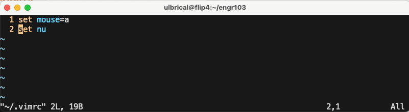
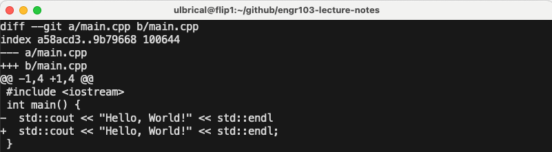

:::caution
You don't have to use the development tools discussed below for this class. Feel free to use whatever tools you'd like. However, maintaining a working development environment is your responsibility. The TAs and I can only offer guidance when you're using tools that we're familiar with, so it's recommended that you stick with the below tools unless you're already familiar with other ones that will accomplish the same tasks.
:::

## Terminals

A terminal is a program that lets us interface with our computer via textual commands that get interpreted by another internal program called a shell. All of the software we write in this class will be text-based.

That means that our programs will not create windows or tabs with graphical user interfaces. Instead, we will run our programs by issuing textual commands in a terminal, and they will output responses through text in the terminal as well. Indeed, it's difficult to write, build, and run basic software without some sort of terminal.

Luckily, all modern operating systems come with one or more terminals installed. Follow the instructions below based on your operating system to become acquainted with your terminal.

### Accessing and Configuring Your Terminal

#### Windows: Powershell or Windows Terminal

Windows actually offers a few terminals / shells. The oldest one is the Command shell (CMD). Most people consider it to be obsolete, so I don't recommend using it. The Command shell was superseded by Powershell—lots of people use this one.
To access Powershell, simply search for “Powershell” in the Windows start menu. When you start it, a window should appear with a text cursor. You can now begin issuing textual commands to your computer by typing them and pressing enter. We'll learn about some commands shortly.
When you open Powershell for the first time, it will default to a certain configuration that most people don't like, so you may want to do some reconfiguration. If you right click on the window's menu bar (the top of the window) and click “Properties”, you can configure your terminal to your liking (e.g., background colors, font colors, font sizes, etc).

#### macOS: Terminal

Mac comes with a terminal by default. It's simply called “Terminal”, and you can find it by typing “Terminal” into the Mac Spotlight search (the magnifying glass at the topright corner of your screen). When you open your Mac Terminal for the first time, it will default to a certain configuration that most people don't like, so you may want to do some reconfiguration. In the menu bar, navigate to Terminal → Preferences, then navigate to the Profiles tab. From here, you can add new terminal profiles and modify existing ones. A profile is basically just a configuration of terminal settings. For most cases, it's sufficient to just modify the default profile (e.g., “Basic”). You can change default font sizes, colors, etc.

#### UNIX/Linux

If you're running a UNIX/Linux OS other than macOS (e.g., Ubuntu, FreeBSD, etc), then you probably already know what a terminal is. Most *nix terminals are extremely similar since the default shell is configured at a user level, so use whatever terminal you want.

:::tip[Some Other Terminal Programs]
In no specific order:

- [Alacritty](https://alacritty.org/)
- [iTerm2](https://iterm2.com/)
- [Hyper](https://hyper.is/)
- [Warp](https://www.warp.dev/)
- [Terminus](https://termius.com/)
- [Tabby](https://tabby.sh/)

Consider a cross-shell prompt, such as [Starship](https://starship.rs/), [Oh My Posh](https://ohmyposh.dev/), or [Powerline](https://github.com/powerline/powerline) to make your shell environment look good across platforms.
:::

## ENGR Servers

A terminal is similar to file explorers like **Windows File Explorer** or **Mac Finder**, but entirely text-based. By typing commands into the terminal and pressing Enter, you can navigate the file system, view, edit, and even execute files (if they're executable). While a terminal can perform everything a graphical file explorer can, it also offers functionality that file explorers can't. This makes terminals indispensable for tasks requiring fine-grained control over your computer, such as software development.

In this course, we'll be working a bit differently. Instead of using the terminal to control your own computer, you'll primarily use it to interact with a remote computer. Specifically, we'll be using powerful machines located in the Kelley Engineering Center's server room at Oregon State University (OSU). These are referred to as the ENGR servers.

The ENGR servers don't have physical monitors, mice, or keyboards attached, and access to the server room is restricted to authorized faculty and staff. So, how will we use these servers?

To control the ENGR servers, you'll use a remote connection via your computer's terminal. By issuing a single command, your computer will connect to the ENGR servers over the internet, giving you access to a remote shell. This allows you to type commands into your local terminal to control the ENGR servers, as if you were using them directly.

Accessing the ENGR servers requires authentication. If you don’t already have an ENGR account, you’ll need to create one:

1. Visit the [CoE TEACH](https://teach.engr.oregonstate.edu/teach.php) website.
2. Click **“Create a new account”**
3. Follow the on-screen instructions to create your ENGR account.

Once your account is created and you have internet access, you’ll be ready to connect to and work on the ENGR servers.

To do this, type the following command into your terminal and press enter, substituting `<ONID>` with your ONID username (e.g., mine is `ulbrical`):

```sh
ssh <ONID>@access.engr.oregonstate.edu
```

`ssh` stands for **Secure Shell**, a cryptographic network protocol that allows you to securely connect to and control a remote computer. It uses predefined user accounts and permissions to authenticate and manage access.

When you connect to the ENGR servers using ssh, your terminal will prompt you for a password. If this doesn't happen, it may indicate an issue with your internet connection or that the ENGR servers are temporarily unavailable.

1. Type your ONID password (the same one you use for OSU services like Canvas and Outlook) and press Enter. Your password will not appear as you type--it's invisible for security reasons. This is expected.
2. After entering your password, you'll be prompted to verify your login using Duo.
  - If you have multiple Duo devices, the terminal will ask you to select which device to use. Type the corresponding number and press Enter.
  - Approve the Duo push notification on your device.

Once authenticated, you should see a screen indicating that you are now logged into the ENGR servers.


The ENGR servers run **Linux**, so any commands you type into the terminal will now be interpreted as **Linux shell commands**. You can customize your shell settings on the TEACH platform if needed, but the default configuration will work fine for this course.

Now that you’re logged in, your terminal is controlling the ENGR servers, not your personal computer. This means:

- **File Operations Are Remote**: Any files you create, edit, or manage will exist on the ENGR servers and not on your local computer. These files will not appear in tools like Windows File Explorer or Mac Finder unless you transfer them.
- **Transferring Files**: To move files between your local computer and the ENGR servers, you'll need to use a file transfer protocol such as **SFTP** (Secure File Transfer Protocol) or **SCP** (Secure Copy Protocol). If you're interested, you can look up tutorials for these tools.

:::note[Terminology: Local vs. Remote]

**Local** refers to actions or files on your own computer. **Remote** refers to actions or files on the ENGR servers (or any server you're connected to). Understanding this distinction will be essential as we work on the ENGR servers throughout the course.
:::

## The Prompt

The prompt is essentially a marker for where you can type commands. It appears every time the shell is ready to accept input. A simple example of a default prompt might look like this:

```sh
user@hostname:~$
```

### Components

The prompt typically provides useful contextual information. Here's a breakdown of common elements.

- Username (`user`): indicates the user currently logged into the system.
- Hostname (`hostname`): shows the name of the computer or server you're connected to, it's helpful in identifying the machine when working on multiple systems.
- Current Working Directory: shows the directory you're currently in, `~` means it's your `/home` directory, but it can be specific, e.g. `/var/log`.
- Shell Account Type: `$` means you're' a normal user, while `#` indicates elevated permissions (superuser/root).

### Interactive Features

- Tab Completion
- Command History
- Aliases

## Shell Commands

Now that our terminal is connected to the ENGR servers, we should learn how to use it. To summarize, here is a table briefly describing some important Linux shell commands:

| Command | Description |
| ------- | ----------- |
| `ssh <connection_string>` | Connects to the SSH server specified by the connection string. You already used this command locally (from your computer) to connect to the ENGR servers. |
| `pwd` | Prints the working directory. |
| `ls <path>` | Lists the files and directories within directory located at the specified path. Lists the files and directories within the working directory if `<path>` is omitted. |
| `mkdir <path>` | Creates a new directory at the specified path. |
| `cd <path>` | Navigates to the directory at the specified path, making it the new working directory. Navigates one level up in the directory tree if `<path>` is omitted or is `..`. |
| `clear` | Clears the text on-screen in the terminal. |
| `cp <path1> <path2>` | Copies the file located at the specified `<path1>` to the location specified by `<path2>`. `cp -r <path1> <path2>` can be used to copy an entire directory and all of its contents.|
| `mv <path1> <path2>` | Moves the file or directory located at the specified `<path1>` to the location specified by `<path2>`. This can also be used to rename files/directories. If the specified `<path2>` already exists and is itself a directory, this will move the file/directory located at the specified `<path1>` into the directory located at the specified `<path2>`. |
| `rm <path>` | Removes (deletes) the file located at the specified path. To remove an entire non-empty directory, use `rm -r <path>`. To remove an empty directory, you can also use `rmdir <path>`. |
| `cat <path1> <path2> ... <pathN>` | Concatenates the contents of the files at all of the specified paths in the order provided and prints the concatenated content to the terminal. Note that this is also used for just printing the contents of a single file. |
| `vim <path>` | Opens the file at the specified path in the vim text editor (see next section). |

### Basic Structure

```sh
command [options] [arguments]
```

#### `command`

The name of the program or script or utility that you want to execute.

Example: `ls` the command to list directory contents.

#### `options` (flags)

Options modify the behavior of the command. They are usually optional.

They often start with a `-` (single dash) for short options or `--` (double dash) for long options.

Example: `ls -l --color`, where `-l` enables long-format listing and `--color` highlights file types and permissions with colors (default is always).

You can also combine short options such as `ls -lsh`, where `-s` prints the allocated size of each file, in blocks, and `-h` makes things human-readable (when combined with `-s`).

#### `arguments`

Inputs to the command, such as file names, directories, or specific data to operate on.

Example:

```sh
cat myfile.txt
``` 

where `myfile.txt` is the argument to the `cat` command, which concatenates file(s) to the standard output.

Commands can accept multiple arguments:

```sh
cp file1.txt file2.txt destination/
```

where `file1.txt` and `file2.txt` are source files, and `destination/` is the target directory.

#### Combining `options` and `arguments`

Options and arguments can be combined in various ways, depending on the command syntax.

```sh
tar -czf archive.tar.gz file1 file2
```

where `-czf` is a combination of options for creating (c), compressing (z), and specifying a file (f), `archive.tar.gz` is the argument specifying the output file, and `file1` and `file2` are the files to archive.

### Using the Shell

A terminal can be thought of as a text-based version of a file explorer. At any given time, your terminal (or shell) operates within a specific folder, referred to as a **directory**. The directory you are currently working in is called the **working directory**.

To see your current working directory, use the following command:

```bash
pwd
```

`pwd` stands for “print working directory,” which means it will display your current directory in the terminal. For example:

```bash
/nfs/stak/users/ulbrical
```

After logging into the ENGR servers, your working directory will default to your **home directory**. This directory is specific to your account, and its path will include your ONID username.

To view the files and directories within your working directory, use:

```bash
ls
```

`ls` stands for “list.” Its output might include color-coded items.

A path specifies the location of a file or directory. Paths use a path separator (`/` on Linux systems) to separate directories. For example:

```text
A/B/C.jpg
```

This path represents a file `C.jpg` inside directory `B`, which is inside directory `A`.

We distinguish between two types of paths:

- **Absolute Paths**: Start from the root directory (`/`) and specify the full path to a file or directory. For example:

```text
/nfs/stak/users/<ONID>/A/B/C.jpg
```

- **Relative Paths**: Start from the current working directory and specify the path relative to it. For example:

```text
A/B/C.jpg
```

We also have some special path shortcuts:

- `.` refers to the current directory.
- `..` refers to the parent directory.
- `~` represents your home directory. For example, `~/A` is equivalent to `/nfs/stak/users/<ONID>/A`.

To create a new directory, use:

```bash
mkdir <path>
```

For example

```bash
mkdir A
```

This creates a directory named `A` in the current working directory. If you want to create a directory along with its parent directories, use the `-p` flag:

```bash
mkdir -p A/B/C
```

This command creates `A`, `B`, and `C` if they don't already exist.

To move to a different directory, use:

```bash
cd <path>
```
For example:

```bash
cd A
```
This sets your working directory to A. You can return to your home directory by running either of the following:

```bash
cd
cd ..
```

To clean up your terminal screen, use:

```bash
clear
```

This command behaves differently depending on the terminal:

- Some terminals scroll down to clear the screen.
- Others erase the entire presentation buffer, preventing you from scrolling back up.

Experiment with your terminal to understand how it behaves.

To copy a file, use:

```bash
cp <source_path> <destination_path>
```
For example:

```bash
cp file1.txt file2.txt
```

This copies `file1.txt` to `file2.txt`. To copy an entire directory, add the `-r` flag (recursive):

```bash
cp -r dir1 dir2
```

To move a file or directory, use:

```bash
mv <source_path> <destination_path>
```

For example:

```bash
mv file1.txt dir1/
```

This moves `file1.txt` into `dir1/`. You can also use `mv` to rename files:

```bash
mv old_name.txt new_name.txt
```

This renames the file from `old_name.txt` to `new_name.txt`.

To delete a file, use:

```bash
rm <path>
```

For example:

```bash
rm file1.txt
```

To remove a directory and all its contents, use the `-r` flag:

```bash
rm -r dir1
```

Most shell commands require a path as an argument. For example, to list the contents of a specific directory, use:

```bash
ls <path>
```
This command displays the contents of the directory at `<path>`. Similarly, paths are used with commands like `cp`, `mv`, and `rm` to specify files or directories to operate on.

By mastering these basic commands, you can effectively navigate and manage files within the terminal:

- Use `pwd`, `ls`, and `cd` to explore directories.
- Use `mkdir`, `cp`, `mv`, and `rm` to create, copy, move, or delete files and directories.
-	Understand the difference between relative and absolute paths to work efficiently in the terminal.

### Additional Concepts

In the previous section, we covered essential file and directory management commands to help you navigate and manipulate your system. Now, let's explore more advanced terminal concepts that enhance the power and flexibility of the command line: pipes, redirection, subcommands, environment variables, and command order and logic.

These concepts allow you to chain commands, manage output and input efficiently, and work with complex logic in the shell. Let's dive in.

#### Pipes

A pipe connects the output of one command directly to the input of another, enabling you to chain commands together to perform complex tasks efficiently. The pipe operator (`|`) makes it easy to process data without creating intermediate files.

Example:

```bash
ls | grep "example"
```
- `ls` lists the files in the directory.
- `grep "example"` filters the output, showing only files or directories that contain “example” in their name.

Pipes are powerful for combining commands to handle streams of text, like filtering log files, processing data, or chaining utilities.

#### Redirection

Redirection allows you to control where a command's output goes or where it takes input from. This is particularly useful for saving output to files or providing input to commands.

- Output Redirection (`>`) redirects the output of a command to a file, overwriting the file if it exists.

```bash
echo "Hello, World!" > output.txt
```

- Append Output (`>>`) appends the output of a command to a file without overwriting it.

```bash
echo "Another line" >> output.txt
```

- Input Redirection (`<`) redirects a file as input to a command.

```bash
wc -l < input.txt
```

Here, the `wc -l` command counts the lines in `input.txt`.

Redirection enables you to store results, feed data into commands, or even create complex workflows with minimal effort.

#### Environment Variables

Environment variables are dynamic values stored in the shell's environment that can influence how commands and programs operate. They're often used to store system-wide configurations or user-specific settings.

Common Environment Variables:
- `PATH`: Directories where the shell looks for executable files.
- `HOME`: The current user's home directory.
- `USER`: The name of the current user.

```bash
echo $HOME
```

This command prints the value of the `HOME` environment variable, which should return something like `/nfs/stak/users/<ONID>` on the ENGR servers.

You can also define your own variables:

```bash
MY_VAR="Hello, World!"
echo $MY_VAR
```

Environment variables are invaluable for customizing your shell, managing system settings, and scripting.

#### Command Order and Logic

The shell allows you to execute commands in specific orders and combine them using **logical operators** for advanced control. This lets you define conditions for when commands should run.

- `&&` executes the next command only if the previous command succeeds.

```bash
mkdir new_dir && cd new_dir
```

- `||` executes the next command only if the previous command fails.

```bash
cd nonexistent_dir || echo "Directory not found"
```

- `;` executes commands sequentially, regardless of success or failure.

```bash
echo "First" ; echo "Second"
```
These operators provide fine-grained control over the flow of commands, enabling you to automate and script tasks with precision.

#### Subshell

A subshell is a separate child process created by the shell to execute commands. It inherits the environment of the parent shell but operates independently. When a subshell runs a command or a group of commands, changes made in the subshell (like variable assignments or directory changes) do not affect the parent shell.

```bash
(cd /tmp && ls)
```

- `( ... )` runs the enclosed commands in a subshell.
- Here, the subshell changes to `/tmp` and lists its contents.
- The parent shell remains in its original directory after the subshell completes.

#### Command Substitution

Command substitution is a way to capture the output of a command and use it in another command. This is achieved using the `$()` syntax, making it a crucial tool for dynamic command generation and scripting. When using `$()`, the shell spawns a subshell to execute the command inside the `$()` and replaces the substitution with the command's output.

```bash
echo "Today is $(date)"
```

## Text Editor: vim

By now, you should have a solid understanding of how to navigate a file system in the terminal. The next step is learning how to create and edit text-based files directly in the terminal. To do this, we'll use a terminal-based text editor--a program that runs within the terminal instead of a separate window (like Notepad or Microsoft Word). On the ENGR servers, you have access to editors like vim, nano, and emacs. For this course, we'll focus on vim.

{/* TODO: some vim history */}

To open a file in vim, use the following command:

```bash
vim <path>
```

This opens the file at the specified path. If the file doesn't exist, vim will create it. For instance, to create a file named `hello.txt` in your current directory, you would run:

```bash
vim hello.txt
```

Vim is similar to editors like Notepad or Word, but it's entirely terminal-based, so there are no visible menu buttons. For example, after opening `hello.txt`, your terminal might look something like this: 


Your screen might differ slightly (e.g., it might not show line numbers), but the general interface will be similar. Note that any menu-like elements belong to your terminal, not vim itself. Actions like saving, quitting, and copying text in vim are done via text-based commands.

Vim operates in several **modes**, and understanding these is key to using it effectively. By default, vim starts in **normal mode**, which is used for issuing commands (e.g., saving a file, quitting vim, copying, pasting). If you want to write text into a file, you need to switch to **insert mode**":

- Press the `i` key to switch to insert mode.
- You can now start typing into the file. For example, write the text `Hello, world!` into `hello.txt`: 
  


:::tip
Vim hotkeys and commands are case-sensitive. For example, `i` (lowercase) and `I` (uppercase) both switch to insert mode, but other commands may differ. Ensure caps lock is off to avoid errors.
:::

Saving a file and quitting vim requires issuing commands in normal mode. Since you cannot issue commands in insert mode, you must first switch back to normal mode:

1. Press the Esc key to exit insert mode and return to normal mode.
2. To issue a command, type a colon `:`. The colon will appear at the bottom-left of the screen.
3. Follow the colon with the desired vim command. 

| Command | Description |
| ------- | ----------- |
| `w`  | Write (save) the file |
| `q` | Quit vim (without saving) | 
| `wq` | Write (save) the file and quit | 
| `set mouse=a` | Enable the mouse in vim (it's disabled by default) | 
| `set nu` | Display line numbers | 
| `syntax on` | Enable syntax highlighting (usually enabled by default, but may need to be enabled in certain circumstances) | 
| `colorscheme <colorscheme>` | Set the syntax highlighting colorscheme. Writing `:colorscheme` and pressing tab should cycle you through the available options. | 

{/* TODO insert table */}

To save and quit the file, use the `:wq` command:

```bash
:wq
```


After pressing **Enter**, you'll return to your regular SSH session.

You can customize vim by creating a file named `.vimrc` in your home directory. Open it in vim:

```bash
vim ~/.vimrc
```

Add vim commands (without colons) to configure default settings. For instance:

- Enable line numbers.
- Allow mouse usage.

Each command should go on its own line.



To confirm that a file was saved, run the following command in the correct directory:

```bash
ls
```

This will show `hello.txt` in your working directory. 

To show hidden files (like `.vimrc`), use the `-a` flag:

```bash
ls -a ~
```

You can use the `cat` command to view the contents of a file. Originally designed to concatenate files, `cat` also works for a single file, printing its contents to the terminal. For example:

```bash
cat hello.txt
```

This will display the text you wrote in `hello.txt`. If you want to view the contents of a file without opening it in an editor, `cat` is a quick and easy way to do so.

The cat command can also concatenate multiple files. For example:

```bash
cat file1.txt file2.txt file3.txt
```
This will combine the contents of `file1.txt`, `file2.txt`, and `file3.txt` in order, displaying the result in the terminal.

By following these steps, you've learned how to create, edit, save, and view text-based files directly in the terminal. With vim and cat, you're equipped to efficiently manage text files on the ENGR servers.

## Git

Imagine you've been working on a large program for weeks. You've completed 90% of the work, and everything seems to function properly. Only a few small changes remain. You make those changes, and… uh oh! Suddenly, everything breaks. With the deadline looming, you're left scrambling with nothing to deliver.

This scenario highlights how delicate code can be, especially if it isn't written robustly. To avoid such setbacks, it's essential to save frequent snapshots (backups) of both working and non-working versions of your code. This is where Version Control Systems (VCS) come in, and the most popular VCS is Git.

### What is Git?

Git allows you to save snapshots, called commits, of your code at any point in time. While it can handle any type of digital project, it's especially popular among software engineers. Git uses a space-efficient method called delta compression to store changes, making it ideal for tracking modifications between commits.

Git is a command-line utility, meaning you interact with it through a terminal. It's pre-installed on the ENGR servers, so you can use it there via SSH. You can also install Git on your personal computer.

### Configuring Git

Before using Git, you must configure some global settings, such as your name and email address. These are stored with every commit you create. To set them up, run the following commands, replacing `<your_name>` and `<your_email>` with your full name and email:

```bash
git config --global user.name "<your_name>"
git config --global user.email "<your_email>"
```

You can update these settings at any time, and they can also be overridden with project-specific settings.

:::tip
If you are using GitHub, it will provide you with a GitHub-specific email address if you have email privacy enabled. You can use this email address for your Git configuration. It looks something like: `<gh_username>@users.noreply.github.com`.

This will be used for web-based Git operations. You can also use your personal email address if you prefer.
:::

### Understanding Repositories

Git works by tracking repositories (or repos), which are tagged directories containing your project files. There are two ways to create a Git repo:

1. **Clone a GitHub Repo**: Create a repo on a hosting platform like GitHub, then use the `git clone` command to copy it to your local filespace. This creates a directory tagged as a Git repo, containing all the files from the remote GitHub repo, and sets up synchronization between them.
2. **Initialize a Local Repo**: Use the `git init` command to tag an existing local directory as a Git repo. You can optionally configure this local repo to sync with a remote one, such as a GitHub repo.

For this course, we'll focus on the first method.

### Creating and Cloning a Repo on GitHub

To create a GitHub repo, follow the steps on the platform's web interface. After creating a repo (or accessing one from GitHub Classroom), you can clone it into your filespace using:

```bash
git clone <github-repo-ssh-url>
```

Replace `<github-repo-ssh-url>` with the repo's SSH URL, which can be found on its GitHub page by clicking the green Code button and selecting the SSH tab. Note: You need proper permissions to clone a repo. In Studio 2, you'll learn how to set up these permissions and authenticate with GitHub using SSH keys.

After cloning, run `ls` in your terminal to verify that a new directory matching the repo name appears in your working directory. Navigate into this directory with `cd`, and run `ls` again to see all the files from the GitHub repo.

### Working in a Git Repo

Once your working directory (or one of its parent directories) is tagged as a Git repo, you can use various Git commands. For example, to check the status of your repo, run:

```bash
git status
```

This command, along with all other Git commands, works only when your current working directory is part of a Git repo.

By following these steps, you'll be ready to use Git to manage your projects effectively and avoid last-minute surprises.

Suppose I've just cloned a repository containing a single file, main.cpp, with the following C++ source code:

```cpp 
// main.cpp
#include <iostream>
int main() {
  std::cout << "Hello, World!" << std::endl;
}
```

If I haven't modified this file or added any new files to the repository since cloning, running the command git status will produce output similar to this: 


There are a few important details to understand from this output:

1. `On Branch main`: This line indicates the branch you're currently working on. While branches allow developers to work on different versions of a project simultaneously (and later merge them), we won't cover them in depth in this course. You'll always work on the main branch to keep things simple.
2. `“Your branch is up to date with ‘origin/main’”`: This means your local repository is synchronized with the remote repository on GitHub. In other words, you haven't created any new commits locally that need to be pushed back to GitHub.
3. `“Nothing to commit”`: This indicates that no changes have been made to any files in your repository since the last commit, so there's nothing to save in a new commit. In fact, Git won't let you create a new commit unless changes have been made and staged.

Now, suppose we modify `main.cpp` by removing the semicolon after `std::endl`, as shown below:

```diff lang="cpp"
// main.cpp
  #include <iostream>
  int main() {
-   std::cout << "Hello, World!" << std::endl;
+   std::cout << "Hello, World!" << std::endl
  }
```

Running `git status` again will produce a different output: 


Notice the line under `“Changes not staged for commit”`. Git lists `main.cpp` here, indicating that this file has been modified since the last commit.

In Git, every file in a repository falls into one of three categories:

- **Modified**: Files that have been changed since the last commit or newly created files that haven't been tracked in any commit.
- **Staged**: Files that are prepared to be included in the next commit.
- **Committed**: Files that haven't been changed since they were last saved in a commit.

When creating a new commit, you must decide which files' changes should be included. To prepare files for a commit, you stage them using the `git add` command:

```bash
git add <file1> <file2> ... <fileN>
```

You can also stage entire directories or even the entire repository. For instance, to stage every file in the repository, you can simply stage the root directory.

Let's say we want to commit the changes made to `main.cpp` (with the semicolon removed). First, we stage the file using:

```bash
git add main.cpp
```

Running `git status` again after staging will show a different output: 


The output will now indicate that `main.cpp` is staged and ready to be included in the next commit. This step is crucial for ensuring the latest versions of files are saved properly in your repository.

Once you've staged your changes for the next commit, you can create the commit using the following command:

```bash
git commit -m "<commit_message>"
```

Replace `<commit_message>` with a brief description of the changes. Commit messages should typically be one or two sentences long since commits should be small and frequent.

For example, if I wanted to commit the changes to `main.cpp`, I might use:

```bash
git commit -m "Remove semicolon after std::endl"
```

After running this command, executing git status will produce the following: 


Notice that there are no more modified or staged files—all changes have been committed. However, the output will say, `“Your branch is ahead of ‘origin/main’ by 1 commit.”` This means the new commit exists in your local repository but hasn't been synced with the remote GitHub repository yet. If you visit your GitHub repo at this point, it will still show the outdated version of main.cpp with the semicolon.

To synchronize your local commits with the remote repository, use the git push command:

```bash
git push
```

If your local repo was created by cloning a remote repo, this command should work immediately. However, if your local repo was created with `git init`, you might need to configure the remote connection first. Additionally, pushing changes requires proper permissions, which you'll set up in Studio 2 using SSH keys.

Once you run `git push`, executing `git status` again will confirm that the local and remote repositories are now synchronized. If you refresh your GitHub repository page, you'll see that main.cpp has been updated, and the semicolon is gone.

To view the history of commits in your repository, use:

```bash
git log
```

This will display each commit in reverse chronological order, showing the commit's hash (a unique identifier), author, timestamp, and commit message. For example:


:::note
If the output of `git log` looks strange, there might be a problem with output colorizing. You can disable colors by running `git log --no-color` or to make it default behavior `git config --global color.ui false`.
:::

In this case, there are three commits. The first one (with the message “Initial commit”) was created when the repository was initialized and the second one when the first version of `main.cpp` was added. The third one reflects the recent removal of the semicolon.

If a file in your repository has been modified but not yet staged, you can use `git diff` to view the changes since the last commit:

```bash
git diff <file>
```

For example, if I re-add the semicolon to `main.cpp` and then run:

```bash
git diff main.cpp
``` 

The output will highlight changes, showing removed lines in red (prefixed with a `-`) and added lines in green (prefixed with a `+`). In this case, the only change would be the addition of the semicolon.



If I stage and commit the changes to `main.cpp`, running git log will now show four commits.

Git offers many other commands to manage your repository. One key feature of version control is the ability to revert to previous versions of your work. For this, you can use:

- `git revert`: Creates a new commit that undoes the changes introduced by a previous commit.
- `git reset`: Rewinds your repository's history but is more destructive and should be used carefully.

Other useful commands include:

- `git pull`: Syncs your local repository with the latest changes from the remote repository.
- `git branch`: Manages branches in your repository.
- `git merge` and `git rebase`: Integrate changes from one branch into another.

While we won't cover all of these in this course, the commands introduced here should suffice for your needs. Feel free to explore additional Git commands on your own or ask questions outside of class. I highly recommend **Julia Evans**'s posts, such as this one about [git branches: intuition and reality](https://jvns.ca/blog/2023/11/23/branches-intuition-reality/).