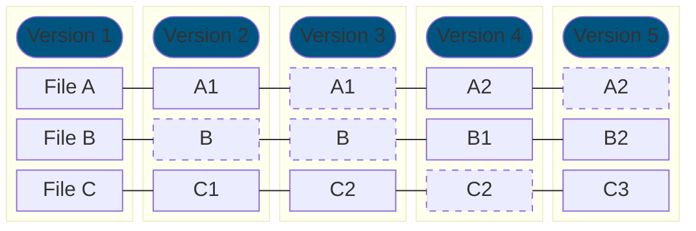
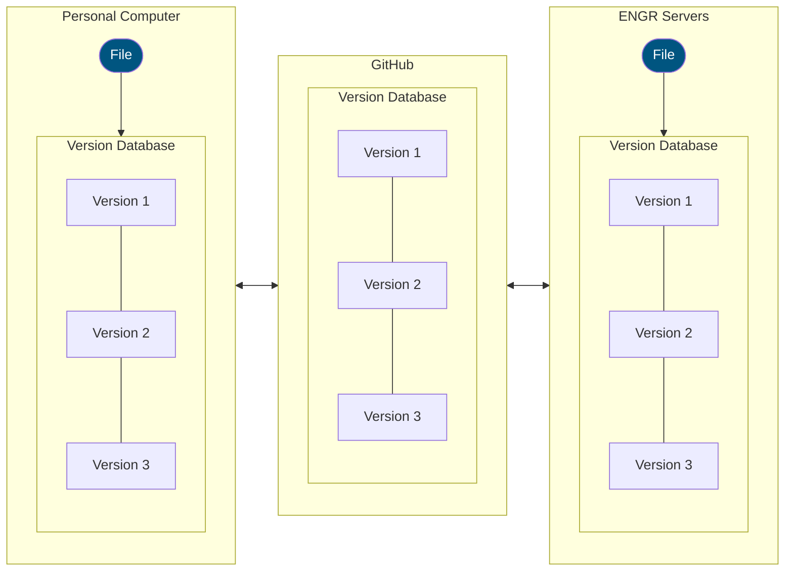
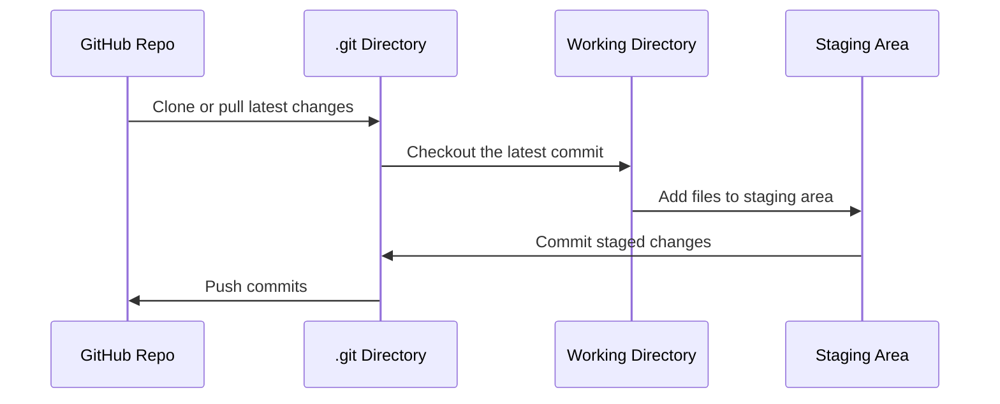

Imagine you've been working on a large program for weeks. You've completed 90% of the work, and everything seems to function properly. Only a few small changes remain. You make those changes, and… uh oh! Suddenly, everything breaks. With the deadline looming, you're left scrambling with nothing to deliver.

This scenario highlights how delicate code can be, especially if it isn't written robustly. To avoid such setbacks, it's essential to save frequent snapshots (backups) of both working and non-working versions of your code. This is where Version Control Systems (VCS) come in, and the most popular VCS is Git.

## What is Git?

Git allows you to track and record changes to files over time using commits. While it can handle various types of digital projects, it's especially popular among software engineers. Git efficiently manages storage using object trees, referencing unchanged content across commits, and employs delta compression when repacking data for space efficiency.



Git is a command-line utility, meaning you interact with it through a terminal. It's pre-installed on the ENGR servers, so you can use it there via SSH. You can also install Git on your personal computer.

## Configuring Git

Before using Git, you must configure some global settings, such as your name and email address. These are stored with every commit you create. To set them up, run the following commands, replacing `<your_name>` and `<your_email>` with your full name and email:

```bash title="Git Configuration"
git config --global user.name "<your_name>"
git config --global user.email "<your_email>"
```

You can update these settings at any time, and they can also be overridden with project-specific settings.

:::tip
If you are using GitHub, it will provide you with a GitHub-specific email address if you have email privacy enabled. You can use this email address for your Git configuration. It looks something like: `<gh_username>@users.noreply.github.com`.

This affects the author email recorded in your commits (and what GitHub displays), not how you authenticate. You can also use your personal email address if you prefer.
:::

You can check that these were configured correctly by running:

```bash title="Check Git Configuration"
git config --list 
```

## Understanding Repositories

Git works by tracking repositories (or repos), which are tagged directories containing your project files. There are two ways to create a Git repo:

1. **Clone a GitHub Repo**: Create a repo on a hosting platform like GitHub, then use the `git clone` command to copy it to your local filespace. This creates a directory tagged as a Git repo, containing all the files from the remote GitHub repo, and sets up synchronization between them.
2. **Initialize a Local Repo**: Use the `git init` command to tag an existing local directory as a Git repo. You can optionally configure this local repo to sync with a remote one, such as a GitHub repo.

For this course, we'll focus on the first method.

Before we start, we need to address the concept of **distributed version control**. Git is a distributed VCS, meaning every location containing the version history is a complete mirror of the entire history, including every version, commit, and snapshot. This allows for offline work and faster operations since most actions are performed locally. Changes can be synchronized with remote repositories (like GitHub) when needed (as we'll see in a minute).



You don't need to understand all the details of distributed version control to use Git effectively. The key takeaway is that every copy (clone) of a Git repo contains the full version history, allowing you to work offline and sync changes with remote repositories when needed. **Sync often to "save" your work and avoid last-minute surprises!**

## Creating and Cloning a Repo on GitHub

To create a GitHub repo, follow the steps on the platform's web interface. After creating a repo (or accessing one from GitHub Classroom), you can clone it into your filespace using:

```bash title="Cloning a GitHub Repo"
git clone <github-repo-ssh-url>
```

Replace `<github-repo-ssh-url>` with the repo's SSH URL, which can be found on its GitHub page by clicking the green Code button and selecting the SSH tab. Note: You need proper permissions to clone a repo. In Studio 2, you'll learn how to set up these permissions and authenticate with GitHub using SSH keys.

After cloning, run `ls` in your terminal to verify that a new directory matching the repo name appears in your working directory. Navigate into this directory with `cd`, and run `ls` again to see all the files from the GitHub repo.

## Working in a Git Repo

Once your working directory (or one of its parent directories) is tagged as a Git repo, you can use various Git commands. For example, to check the status of your repo, run:

```bash title="Check Git Repo Status"
git status
```

This command, along with all other Git commands, works only when your current working directory is part of a Git repo.

By following these steps, you'll be ready to use Git to manage your projects effectively and avoid last-minute surprises.

Suppose I've just cloned a repository containing a single file, `main.cpp`, with the following C++ source code:

```cpp 
// main.cpp
#include <iostream>
int main() {
  std::cout << "Hello, World!" << std::endl;
}
```

If I haven't modified this file or added any new files to the repository since cloning, running the command `git status` will produce output similar to this: 

```text title="git status" frame="terminal"
On branch main
Your branch is up to date with 'origin/main'. 

nothing to commit, working tree clean
```

There are a few important details to understand from this output:

1. `On branch main`: This line indicates the branch you're currently working on. While branches allow developers to work on different versions of a project simultaneously (and later merge them), we won't cover them in depth in this course. You'll always work on the main branch to keep things simple.
2. `“Your branch is up to date with ‘origin/main’”`: This means your local repository is synchronized with the remote repository on GitHub. In other words, you haven't created any new commits locally that need to be pushed back to GitHub.
3. `“Nothing to commit”`: This indicates that no changes have been made to any files in your repository since the last commit, so there's nothing to save in a new commit. (By default, Git won't create a new commit unless there's something staged, though you *can* create an empty commit with special flags.)

Now, suppose we modify `main.cpp` by changing the text being printed, as shown below:

```diff lang="cpp" title="Modified main.cpp"
// main.cpp
  #include <iostream>
  int main() {
-   std::cout << "Hello, World!" << std::endl;
+   std::cout << "Hello, Git!" << std::endl;
  }
```

Running `git status` again will produce a different output: 

```text title="git status" frame="terminal"
On branch main
Your branch is up to date with 'origin/main'.

Changes not staged for commit:
  (use "git add <file>..." to update what will be committed)
  (use "git restore <file>..." to discard changes in working directory)
        modified: main.cpp

no changes added to commit (use "git add" and/or "git commit -a")
```

Notice the line under `“Changes not staged for commit”`. Git lists `main.cpp` here, indicating that this file has been modified since the last commit.

In Git, every file in a repository falls into one of four categories:

- **Untracked**: Files that exist in your directory but are not yet tracked by Git. They become tracked once you add them to the staging area.
- **Modified**: Tracked files that have been changed since the last commit.
- **Staged**: Files that are prepared to be included in the next commit.
- **Committed**: Files that are tracked and unchanged since the last commit.

When creating a new commit, you must decide which files' changes should be included. To prepare files for a commit, you stage them using the `git add` command:

```bash title="Staging Files for Commit"
git add <file1> <file2> ... <fileN>
```

You can also stage entire directories or even the entire repository. For instance, to stage every file in the repository, you can simply stage the root directory.

Let's say we want to commit the changes made to `main.cpp` (changing the greeting message). First, we stage the file using:

```bash title="Staging main.cpp"
git add main.cpp
```

Running `git status` again after staging will show a different output: 

```text title="git status" frame="terminal"
On branch main
Your branch is up to date with 'origin/main'.

Changes to be committed:
  (use "git restore --staged <file>..." to unstage)
        modified: main.cpp
```

The output will now indicate that `main.cpp` is staged and ready to be included in the next commit. This step is crucial for ensuring the latest versions of files are saved properly in your repository.

Once you've staged your changes for the next commit, you can create the commit using the following command:

```bash title="Commit with Message Syntax"
git commit -m "<commit_message>"
```

Replace `<commit_message>` with a brief description of the changes. Commit messages should typically be one or two sentences long since commits should be small and frequent.

For example, if I wanted to commit the changes to `main.cpp`, I might use:

```bash title="Committing Changes"
git commit -m "Change greeting message"
```

After running this command, executing git status will produce the following: 

```text title="git status" frame="terminal"
On branch main
Your branch is ahead of 'origin/main' by 1 commit. 
  (use "git push" to publish your local commits)

nothing to commit, working tree clean
```

Notice that there are no more modified or staged files—all changes have been committed. However, the output will say, `“Your branch is ahead of ‘origin/main’ by 1 commit.”` This means the new commit exists in your local repository but hasn't been synced with the remote GitHub repository yet. If you visit your GitHub repo at this point, it will still show the outdated version of `main.cpp` with the semicolon.

To synchronize your local commits with the remote repository, use the git push command:

```bash title="Pushing Commits to Remote Repo"
git push
```

If your local repo was created by cloning a remote repo, this command should work immediately. However, if your local repo was created with `git init`, you might need to configure the remote connection first. Additionally, pushing changes requires proper permissions, which you'll set up in Studio 2 using SSH keys.



Once you run `git push`, executing `git status` again will confirm that the local and remote repositories are now synchronized. If you refresh your GitHub repository page, you'll see that `main.cpp` has been updated, and the semicolon is gone.

To view the history of commits in your repository, use:

```bash title="Viewing Commit History"
git log
```

This will display each commit in reverse chronological order, showing the commit's hash (a unique identifier), author, timestamp, and commit message. For example:

```text title="git log" frame="terminal"
commit 130725a6befde506775aa4610245b286a02ead4f (HEAD -> main, origin/main, origin/HEAD)
Author: Alexander Ulbrich <adulbrich@users.noreply.github.com>
Date:   Thu Dec 19 15:28:13 2024 -0800

    Change greeting message

commit 7c611b02d9e1b63b6df4cd45e5ea564f71e7a722
Author: Alex Ulbrich <adulbrich@users.noreply.github.com>
Date:   Thu Dec 19 15:22:38 2024 -0800

    Create main.cpp

commit 9e6fba2790876d34a89a2c004928cba3ad2fa52e
Author: Alex Ulbrich <adulbrich@users.noreply.github.com>
Date:   Thu Dec 19 15:15:10 2024 -0800

    Initial commit
```

:::note
If the output of `git log` looks strange, there might be a problem with output colorizing. You can disable colors by running `git log --no-color` or to make it default behavior `git config --global color.ui false`.
:::

In this case, there are three commits. The first one (with the message “Initial commit”) was created when the repository was initialized and the second one when the first version of `main.cpp` was added. The third one reflects the recent removal of the semicolon.

If a file in your repository has been modified but not yet staged, you can use `git diff` to view the changes since the last commit:

```bash title="Viewing Changes with git diff"
git diff <file>
```

For example, if I accidentally remove the semicolon in `main.cpp` and then run:

```bash title="Viewing Changes to main.cpp with git diff"
git diff main.cpp
``` 

The output will highlight changes, showing removed lines in red (prefixed with a `-`) and added lines in green (prefixed with a `+`). In this case, the only change would be the addition of the semicolon.

```text title="git diff main.cpp" frame="terminal"
diff -git a/main.cpp b/main.cpp
index a58acd3..9b79668 100644
--- a/main.cpp
+++ b/main.cpp 
@@ -1,4 +1,4 @@
 #include <iostream>
 int main() {
-  std::cout << "Hello, Git!" << std::endl;
+  std::cout << "Hello, Git!" << std::endl
 }
```

If I stage and commit the changes to `main.cpp`, running git log will now show four commits.

Git offers many other commands to manage your repository. One key feature of version control is the ability to revert to previous versions of your work. For this, you can use:

- `git revert`: Creates a new commit that undoes the changes introduced by a previous commit.
- `git reset`: Rewinds your repository's history but is more destructive and should be used carefully.

Other useful commands include:

- `git pull`: Syncs your local repository with the latest changes from the remote repository.
- `git branch`: Manages branches in your repository.
- `git merge` and `git rebase`: Integrate changes from one branch into another.

While we won't cover all of these in this course, the commands introduced here should suffice for your needs. Feel free to explore additional Git commands on your own or ask questions outside of class. I highly recommend **Julia Evans**'s posts, such as this one about [git branches: intuition and reality](https://jvns.ca/blog/2023/11/23/branches-intuition-reality/).