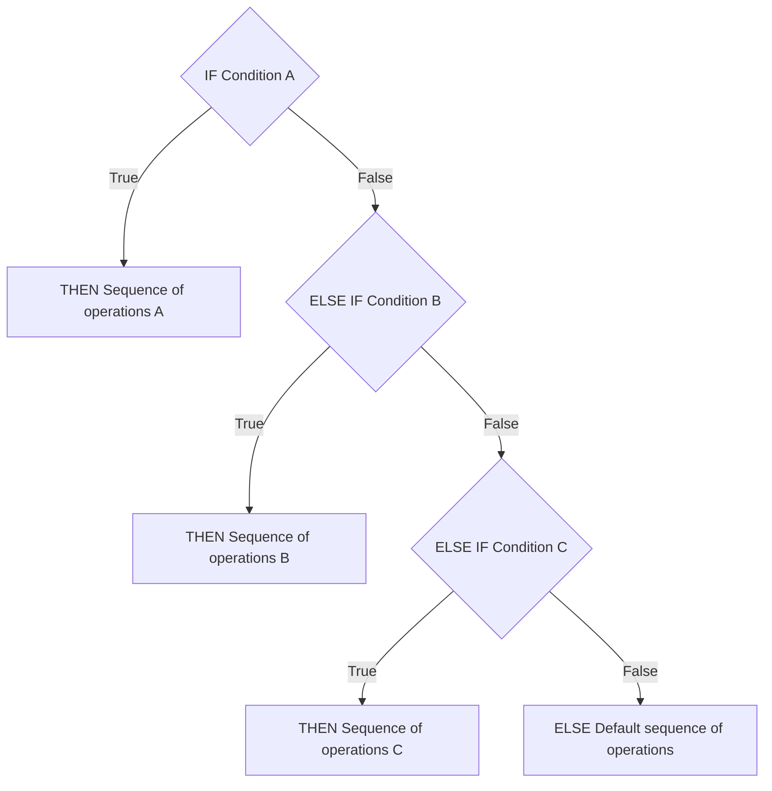

Now that we know how to evaluate conditions using booleans and relational and logical operators, we can explore how to control the flow of our programs based on these conditions. This is where **conditional statements** come into play.

Conditional logic in programming is often represented in the following structure, common to most languages, including C++:

1. **If** a specific condition is satisfied/true, **then** execute a particular sequence of operations (A).
2. **Else, if** the first condition is not satisfied, check another condition, and if it's satisfied/true, **then** execute a different sequence of operations (B).
3. ... (repeat as necessary)
4. **Else**, none of the conditions being satisfied/true, **then** execute a *default* sequence of operations.

import Mermaid from "../../../components/Mermaid.astro";

Here's a flowchart to help visualize the steps:

<Mermaid title="">

</Mermaid>

This chain of “**if…else if…else**” logic ensures that *only one* sequence of operations is executed, creating a *mutually* exclusive set of actions. You can include as many **else if** conditions as necessary--or omit them entirely if not needed.

## If Statements in C++

Here's how you can represent this logic in C++:

```cpp
if (condition_A) {
    // Sequence of operations A
} else if (condition_B) {
    // Sequence of operations B
} else if (...) {
    // Sequence of operations ...
} else {
    // Default sequence of operations
}
```

Replace `condition_X` with an *expression* that evaluates to a *boolean* (or can be converted to one, such as an integer). Replace `// Sequence of operations X` with the code you want to execute when the respective condition is satisfied.

In summary, the key points to remember about this structure are:

1. Only **one** sequence of operations is executed.
    - If the first condition is `true`, the first block of code runs, and the rest of the conditions are ignored.
    - If the first condition is `false`, the program evaluates the second condition, and so on.
    - If all conditions are `false`, the *default* `else` block is executed.
2. Each `if`, `else if`, and `else` block is enclosed in curly braces (`{}`), meaning each has its own **scope**.

Below is a basic example of using if statements in C++:

```cpp
// if_statements.cpp
#include <iostream>

/*
 * Function: prompt_for_integer
 * Description: Prompts the user for an integer
 * Returns (int): Integer entered by the user
 */
int prompt_for_integer() {
    std::cout << "Enter an integer: ";
    int user_input;
    std::cin >> user_input;
    return user_input;
}

int main() {
    // Prompt user for a number
    int number = prompt_for_integer();

    // Check the value of the number
    if (number < 10) {
        std::cout << "You entered a number less than 10" << std::endl;
    } else if (number > 10) {
        std::cout << "You entered a number greater than 10" << std::endl;
    } else {
        std::cout << "You entered 10!" << std::endl;
    }
}
```

1. The program first prompts the user to input an integer by calling the `prompt_for_integer` function.
2. The user's input is stored in the variable `number`.
3. The program evaluates the value of number using the following conditional logic:
    - If the number is less than `10`, it outputs: `"You entered a number less than 10"`.
    - If the number is greater than `10`, it outputs: `"You entered a number greater than 10"`.
    - If the number is exactly `10`, it outputs: `"You entered 10!"`.

### Dropping `else if` and `else` Statements

Sometimes, your program may require conditional logic that executes operations only in one or two specific scenarios. If no conditions are met, you might want the program to simply proceed to the next set of instructions without performing any specific operations. In such cases, you can **omit** the `else if` and `else` statements entirely.

Let's modify the earlier example so that the program does nothing if the user enters a value greater than 10. The main function would look like this:

```cpp
int main() {
    // Prompt user for a number
    int number = prompt_for_integer();

    // Check the value of the number
    if (number < 10) {
        std::cout << "You entered a number less than 10" << std::endl;
    } else if (number == 10) {
        std::cout << "You entered 10!" << std::endl;
    }
}
```

- If the user enters a number less than `10`, it prints: `"You entered a number less than 10"`.
- If the user enters exactly `10`, it prints: `"You entered 10!"`.
- If the user enters a number greater than `10`, the program prints *nothing*, as there is no `else` statement to handle this case.

What's the difference between ending with an `else if` statement and not ending with an `else` statement?

- A chain of conditional logic ending with an `else` statement ensures that **exactly one** sequence of operations will execute.
- A chain ending with `else if` (*without* a final `else`) ensures that **at most one** sequence of operations will execute, but it is possible that none will.

It's important to note that code written outside any if, else if, or else statements is unconditional and will always execute. For example:

```cpp
int main() {
    // Prompt user for a number
    int number = prompt_for_integer();

    // Check the value of the number
    if (number < 10) {
        std::cout << "You entered a number less than 10" << std::endl;
    } else if (number == 10) {
        std::cout << "You entered 10!" << std::endl;
    }

    // Unconditional code
    std::cout << "Goodbye!" << std::endl;
}
```

- If the user enters a number less than `10`, it prints `"You entered a number less than 10"` followed by `"Goodbye!"`.
- If the user enters exactly `10`, it prints `"You entered 10!"` followed by `"Goodbye!"`.
- If the user enters a number greater than `10`, it simply prints `"Goodbye!"`.

You can also omit `else if` statements if they are unnecessary. For example:

```cpp
int main() {
    // Prompt user for a number
    int number = prompt_for_integer();

    // Check if the number is exactly 10
    if (number == 10) {
        std::cout << "You entered 10!" << std::endl;
    }

    // Unconditional code
    std::cout << "Goodbye!" << std::endl;
}
```

- If the user enters exactly `10`, it prints `"You entered 10!"` followed by `"Goodbye!"`.
- For all other inputs, it simply prints: `"Goodbye!"`.

It's also valid to have an `if` statement immediately followed by an `else` statement without any `else if` blocks in between. This creates **two mutually exclusive** operations, where **exactly one** will execute. For example:

```cpp
int main() {
    // Prompt user for a number
    int number = prompt_for_integer();

    // Check the value of the number
    if (number < 10) {
        std::cout << "You entered a number less than 10" << std::endl;
    } else {
        std::cout << "You entered 10 or greater!" << std::endl;
    }
}
```

- If the user enters a number less than `10`, it prints `"You entered a number less than 10"`.
- If the user enters a number `10` or greater, it prints: `"You entered 10 or greater!"`.

### If Statements Style

When writing if statements, the **DRY principle** (Don't Repeat Yourself) encourages us to avoid duplicating boundary conditions. By taking advantage of the mutual exclusivity provided by `else if` and `else` semantics, we can write clearer and more concise code.

Here’s an example of a program that demonstrates repeated boundary conditions:

```cpp
// pass_fail.cpp
#include <iostream>

/*
 * Function: prompt_for_grade
 * Description: Prompts the user for a grade percentage as an integer
 * Returns (int): Grade percentage entered by the user
 */
int prompt_for_grade() {
    std::cout << "Enter your grade percentage: ";
    int grade_percentage;
    std::cin >> grade_percentage;
    return grade_percentage;
}

/*
 * Function: print_pass_or_fail
 * Description: Prints whether the user passed or failed based on the grade percentage
 * Parameters:
 *   grade (int): Grade percentage
 */
void print_pass_or_fail(int grade) {
    if (grade < 60) {
        std::cout << "You failed!" << std::endl;
    }

    if (grade >= 60) {
        std::cout << "You passed!" << std::endl;
    }
}

int main() {
    // Prompt user for grade
    int grade = prompt_for_grade();

    // Print pass/fail
    print_pass_or_fail(grade);
}
```

- If the grade is less than `60`, the program prints: `"You failed!"`.
- If the grade is `60` or greater, the program prints: `"You passed!"`.

While this program works correctly, the implementation has stylistic issues:

1. The two `if` statements check mutually exclusive conditions, but they are written as separate, *independent* `if` statements. This could imply (incorrectly) that both conditions might execute, which is not the case.
2. The program unnecessarily checks the boundary (`grade >= 60`) explicitly, even though it's logically implied by the first condition (`grade < 60` being `false`).

To address one these concerns, the second `if` statement can be replaced with an `else if` statement. This makes it explicitly clear that only one of the conditions will execute:

```cpp
/*
 * Function: print_pass_or_fail
 * Description: Prints whether the user passed or failed based on the grade percentage
 * Parameters:
 *   grade (int): Grade percentage
 */
void print_pass_or_fail(int grade) {
    if (grade < 60) {
        std::cout << "You failed!" << std::endl;
    } else if (grade >= 60) {
        std::cout << "You passed!" << std::endl;
    }
}
```

By using `else if`, the code now explicitly reflects the mutual exclusivity of the conditions. It's clear that **only one** of the two blocks of code will execute, making the program easier to understand.

Since the conditions `grade < 60` and `grade >= 60` are complementary (i.e., if one is `false`, the other must be `true`), there's no need to explicitly check the second condition. Instead, the `else if` can be replaced with an `else`:

```cpp
/*
 * Function: print_pass_or_fail
 * Description: Prints whether the user passed or failed based on the grade percentage
 * Parameters:
 *   grade (int): Grade percentage
 */
void print_pass_or_fail(int grade) {
    if (grade < 60) {
        std::cout << "You failed!" << std::endl;
    } else {
        std::cout << "You passed!" << std::endl;
    }
}
```

Using `else` makes it even clearer that **exactly one** of the two blocks will execute. The program no longer repeats the boundary condition, resulting in cleaner and more efficient code.

The problem with the original program is that it redundantly checked the same boundary twice:

1. It checked if `grade < 60`.
2. It then checked if `grade >= 60`.

By leveraging mutual exclusivity, you can avoid such repetition, resulting in:

1. Cleaner, more concise code.
2. Syntax that better aligns with the intended logic, improving readability and maintainability.
3. Improved performance, as the program doesn't need to evaluate the same condition twice.

### Implied Curly Braces

Coming Soon!

### Nested If Statements

Coming Soon!

## Short Circuiting

Coming Soon!

## Common Mistakes

Coming Soon!

### Incomplete Logical operands

Coming Soon!

### Else without If and Vice Versa

Coming Soon!

### Assignment Instead of Equality (and “Yoda notation”)

Coming Soon!

### Exact Equality for Floating Point Numbers

Coming Soon!

