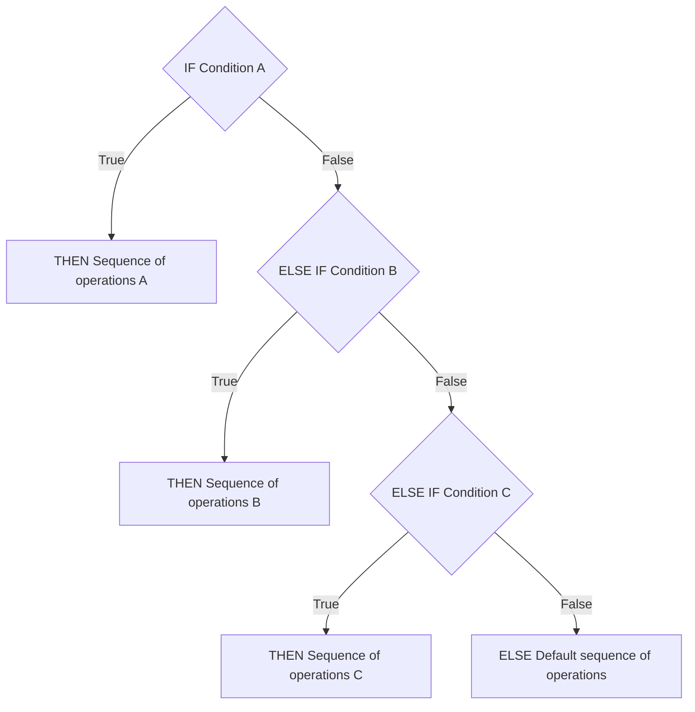

import Latex from '../../../components/Latex.astro'

Now that we know how to evaluate conditions using booleans and relational and logical operators, we can explore how to control the flow of our programs based on these conditions. This is where **conditional statements** come into play.

Conditional logic in programming is often represented in the following structure, common to most languages, including C++:

1. **If** a specific condition is satisfied/true, **then** execute a particular sequence of operations (A).
2. **Else, if** the first condition is not satisfied, check another condition, and if it's satisfied/true, **then** execute a different sequence of operations (B).
3. ... (repeat as necessary)
4. **Else**, none of the conditions being satisfied/true, **then** execute a *default* sequence of operations.

Here's a flowchart to help visualize the steps:



This chain of “**if…else if…else**” logic ensures that *only one* sequence of operations is executed, creating a *mutually* exclusive set of actions. You can include as many **else if** conditions as necessary--or omit them entirely if not needed.

## If Statements in C++

Here's how you can represent this logic in C++:

```cpp
if (condition_A) {
    // Sequence of operations A
} else if (condition_B) {
    // Sequence of operations B
} else if (...) {
    // Sequence of operations ...
} else {
    // Default sequence of operations
}
```

Replace `condition_X` with an *expression* that evaluates to a *boolean* (or can be converted to one, such as an integer). Replace `// Sequence of operations X` with the code you want to execute when the respective condition is satisfied.

In summary, the key points to remember about this structure are:

1. Only **one** sequence of operations is executed.
    - If the first condition is `true`, the first block of code runs, and the rest of the conditions are ignored.
    - If the first condition is `false`, the program evaluates the second condition, and so on.
    - If all conditions are `false`, the *default* `else` block is executed.
2. Each `if`, `else if`, and `else` block is enclosed in curly braces (`{}`), meaning each has its own **scope**.

Below is a basic example of using if statements in C++:

```cpp
// if_statements.cpp
#include <iostream>

/*
 * Function: prompt_for_integer
 * Description: Prompts the user for an integer
 * Returns (int): Integer entered by the user
 */
int prompt_for_integer() {
    std::cout << "Enter an integer: ";
    int user_input;
    std::cin >> user_input;
    return user_input;
}

int main() {
    // Prompt user for a number
    int number = prompt_for_integer();

    // Check the value of the number
    if (number < 10) {
        std::cout << "You entered a number less than 10" << std::endl;
    } else if (number > 10) {
        std::cout << "You entered a number greater than 10" << std::endl;
    } else {
        std::cout << "You entered 10!" << std::endl;
    }
}
```

1. The program first prompts the user to input an integer by calling the `prompt_for_integer` function.
2. The user's input is stored in the variable `number`.
3. The program evaluates the value of number using the following conditional logic:
    - If the number is less than `10`, it outputs: `"You entered a number less than 10"`.
    - If the number is greater than `10`, it outputs: `"You entered a number greater than 10"`.
    - If the number is exactly `10`, it outputs: `"You entered 10!"`.

### Dropping `else if` and `else` Statements

Sometimes, your program may require conditional logic that executes operations only in one or two specific scenarios. If no conditions are met, you might want the program to simply proceed to the next set of instructions without performing any specific operations. In such cases, you can **omit** the `else if` and `else` statements entirely.

Let's modify the earlier example so that the program does nothing if the user enters a value greater than 10. The main function would look like this:

```cpp
int main() {
    // Prompt user for a number
    int number = prompt_for_integer();

    // Check the value of the number
    if (number < 10) {
        std::cout << "You entered a number less than 10" << std::endl;
    } else if (number == 10) {
        std::cout << "You entered 10!" << std::endl;
    }
}
```

- If the user enters a number less than `10`, it prints: `"You entered a number less than 10"`.
- If the user enters exactly `10`, it prints: `"You entered 10!"`.
- If the user enters a number greater than `10`, the program prints *nothing*, as there is no `else` statement to handle this case.

What's the difference between ending with an `else if` statement and not ending with an `else` statement?

- A chain of conditional logic ending with an `else` statement ensures that **exactly one** sequence of operations will execute.
- A chain ending with `else if` (*without* a final `else`) ensures that **at most one** sequence of operations will execute, but it is possible that none will.

It's important to note that code written outside any if, else if, or else statements is unconditional and will always execute. For example:

```cpp
int main() {
    // Prompt user for a number
    int number = prompt_for_integer();

    // Check the value of the number
    if (number < 10) {
        std::cout << "You entered a number less than 10" << std::endl;
    } else if (number == 10) {
        std::cout << "You entered 10!" << std::endl;
    }

    // Unconditional code
    std::cout << "Goodbye!" << std::endl;
}
```

- If the user enters a number less than `10`, it prints `"You entered a number less than 10"` followed by `"Goodbye!"`.
- If the user enters exactly `10`, it prints `"You entered 10!"` followed by `"Goodbye!"`.
- If the user enters a number greater than `10`, it simply prints `"Goodbye!"`.

You can also omit `else if` statements if they are unnecessary. For example:

```cpp
int main() {
    // Prompt user for a number
    int number = prompt_for_integer();

    // Check if the number is exactly 10
    if (number == 10) {
        std::cout << "You entered 10!" << std::endl;
    }

    // Unconditional code
    std::cout << "Goodbye!" << std::endl;
}
```

- If the user enters exactly `10`, it prints `"You entered 10!"` followed by `"Goodbye!"`.
- For all other inputs, it simply prints: `"Goodbye!"`.

It's also valid to have an `if` statement immediately followed by an `else` statement without any `else if` blocks in between. This creates **two mutually exclusive** operations, where **exactly one** will execute. For example:

```cpp
int main() {
    // Prompt user for a number
    int number = prompt_for_integer();

    // Check the value of the number
    if (number < 10) {
        std::cout << "You entered a number less than 10" << std::endl;
    } else {
        std::cout << "You entered 10 or greater!" << std::endl;
    }
}
```

- If the user enters a number less than `10`, it prints `"You entered a number less than 10"`.
- If the user enters a number `10` or greater, it prints: `"You entered 10 or greater!"`.

### If Statements Style

When writing if statements, the **DRY principle** (Don't Repeat Yourself) encourages us to avoid duplicating boundary conditions. By taking advantage of the mutual exclusivity provided by `else if` and `else` semantics, we can write clearer and more concise code.

Here's an example of a program that demonstrates repeated boundary conditions:

```cpp
// pass_fail.cpp
#include <iostream>

/*
 * Function: prompt_for_grade
 * Description: Prompts the user for a grade percentage as an integer
 * Returns (int): Grade percentage entered by the user
 */
int prompt_for_grade() {
    std::cout << "Enter your grade percentage: ";
    int grade_percentage;
    std::cin >> grade_percentage;
    return grade_percentage;
}

/*
 * Function: print_pass_or_fail
 * Description: Prints whether the user passed or failed based on the grade percentage
 * Parameters:
 *   grade (int): Grade percentage
 */
void print_pass_or_fail(int grade) {
    if (grade < 60) {
        std::cout << "You failed!" << std::endl;
    }

    if (grade >= 60) {
        std::cout << "You passed!" << std::endl;
    }
}

int main() {
    // Prompt user for grade
    int grade = prompt_for_grade();

    // Print pass/fail
    print_pass_or_fail(grade);
}
```

- If the grade is less than `60`, the program prints: `"You failed!"`.
- If the grade is `60` or greater, the program prints: `"You passed!"`.

While this program works correctly, the implementation has stylistic issues:

1. The two `if` statements check mutually exclusive conditions, but they are written as separate, *independent* `if` statements. This could imply (incorrectly) that both conditions might execute, which is not the case.
2. The program unnecessarily checks the boundary (`grade >= 60`) explicitly, even though it's logically implied by the first condition (`grade < 60` being `false`).

To address one these concerns, the second `if` statement can be replaced with an `else if` statement. This makes it explicitly clear that only one of the conditions will execute:

```cpp
/*
 * Function: print_pass_or_fail
 * Description: Prints whether the user passed or failed based on the grade percentage
 * Parameters:
 *   grade (int): Grade percentage
 */
void print_pass_or_fail(int grade) {
    if (grade < 60) {
        std::cout << "You failed!" << std::endl;
    } else if (grade >= 60) {
        std::cout << "You passed!" << std::endl;
    }
}
```

By using `else if`, the code now explicitly reflects the mutual exclusivity of the conditions. It's clear that **only one** of the two blocks of code will execute, making the program easier to understand.

Since the conditions `grade < 60` and `grade >= 60` are complementary (i.e., if one is `false`, the other must be `true`), there's no need to explicitly check the second condition. Instead, the `else if` can be replaced with an `else`:

```cpp
/*
 * Function: print_pass_or_fail
 * Description: Prints whether the user passed or failed based on the grade percentage
 * Parameters:
 *   grade (int): Grade percentage
 */
void print_pass_or_fail(int grade) {
    if (grade < 60) {
        std::cout << "You failed!" << std::endl;
    } else {
        std::cout << "You passed!" << std::endl;
    }
}
```

Using `else` makes it even clearer that **exactly one** of the two blocks will execute. The program no longer repeats the boundary condition, resulting in cleaner and more efficient code.

The problem with the original program is that it redundantly checked the same boundary twice:

1. It checked if `grade < 60`.
2. It then checked if `grade >= 60`.

By leveraging mutual exclusivity, you can avoid such repetition, resulting in:

1. Cleaner, more concise code.
2. Syntax that better aligns with the intended logic, improving readability and maintainability.
3. Improved performance, as the program doesn't need to evaluate the same condition twice.

### Implied Curly Braces

In C++, it's legal to omit curly braces from the body of an `if` statement (or an `else if` or `else` statement). When you do so, C++ automatically assumes that the single statement immediately following the condition (or the `else` keyword, in the case of an `else` statement) is enclosed within implied curly braces.

The following program demonstrates this behavior and will print `"Two plus two is four!"`:

```cpp
if (2 + 2 == 4)
    std::cout << "Two plus two is four!" << std::endl;
else if (2 + 2 == 5)
    std::cout << "What?! Two plus two is five?!" << std::endl;
else
    std::cout << "Oh no! Math is so hard! :(" << std::endl;
```

Unlike some programming languages, C++ **does not** rely on indentation to determine code structure. This means that the way your code is indented has no effect on its behavior (though proper indentation is critical for human readability). We say that C++ is not whitespace-sensitive.

For example, consider the following program:

```cpp
if (2 + 2 == 100)
    std::cout << "Woo! Two plus two is 100!" << std::endl;
    std::cout << "Hello, World!" << std::endl;
```

At first glance, the indentation might suggest that both `std::cout` statements are part of the `if` condition. However, in reality, only the first statement is part of the `if` block. The second statement (`std::cout << "Hello, World!" << std::endl;`) is unconditional--it will execute regardless of whether the `if` condition is `true`.

The above program is equivalent to:

```cpp
if (2 + 2 == 100)
    std::cout << "Woo! Two plus two is 100!" << std::endl;

std::cout << "Hello, World!" << std::endl;
``` 

While the corrected indentation does not change the behavior of the program, it makes it clearer that the second `std::cout` statement is not part of the `if` condition. This distinction is vital for understanding the program's flow.

Although omitting curly braces is syntactically valid, it can lead to confusion and errors, particularly in situations like the example above. Here's why:

1. **Unintended Behavior**: Without curly braces, only the first statement immediately following the `if` condition is considered part of the conditional block. Any subsequent statements will execute unconditionally, which might not be what you intended.
2. **Readability**: While C++ is indifferent to whitespace and indentation, humans are not. Proper indentation helps developers quickly understand the structure of a program. Omitting curly braces can lead to misleading indentation, making the code harder to read and debug.
3. **Maintainability**: When modifying code that lacks curly braces, it's easy to accidentally *break* logic. For example, adding a new line to an `if` block without adding curly braces could unintentionally make that line unconditional.

To avoid these pitfalls, it's best to always use curly braces for `if` statements, even when the body contains only a single statement. This practice ensures that the code is clear, unambiguous, and less prone to errors.

For example, the program above would be safer and clearer if written as:

```cpp
if (2 + 2 == 100) {
    std::cout << "Woo! Two plus two is 100!" << std::endl;
}

std::cout << "Hello, World!" << std::endl;
```

### Nested If Statements

In C++, you can nest `if` statements, meaning you can place one `if` statement inside another. This creates a structure similar to a logical AND operation, where both conditions must be satisfied for a particular block of code to execute.

```cpp
if (i_like_spaghetti) {
    if (i_like_broccoli) {
        std::cout << "I like both spaghetti AND broccoli!" << std::endl;
    }
}
```

- The outer `if` statement checks if `i_like_spaghetti` is `true`.
- If the condition is `true`, the inner `if` statement is evaluated.
- If `i_like_broccoli` is also `true`, the program prints: `"I like both spaghetti AND broccoli!"`.

If either condition is `false`, the program does nothing. This behavior is analogous to the logical `&&` operator with short-circuiting (i.e., the second condition is not evaluated unless the first condition is `true`).

```cpp
if (i_like_spaghetti) {
    if (i_like_broccoli) {
        std::cout << "I like both spaghetti AND broccoli!" << std::endl;
    } else {
        std::cout << "I only like spaghetti!" << std::endl;
    }
}
```

- If `i_like_spaghetti` is `true` and `i_like_broccoli` is `true`, the program prints `"I like both spaghetti AND broccoli!"`.
- If `i_like_spaghetti` is `true` but `i_like_broccoli` is `false`, the program prints `"I only like spaghetti!"`.
- If `i_like_spaghetti` is `false`, the program prints nothing, regardless of the value of `i_like_broccoli`.

You can rewrite nested `if` statements using the logical`&&` operator. For example:

```cpp
if (i_like_spaghetti && i_like_broccoli) {
    std::cout << "I like both spaghetti AND broccoli!" << std::endl;
} else {
    std::cout << "I'm not sure about what I like!" << std::endl;
}
```

- This version prints `"I like both spaghetti AND broccoli!"` if both conditions are `true`.
- If either condition is `false`, it prints `"I'm not sure about what I like!"`.
- Unlike the nested version, this code **always** prints something.

To replicate the behavior of the nested `if` statements, you can use an `else if` statement:

```cpp
if (i_like_spaghetti && i_like_broccoli) {
    std::cout << "I like both spaghetti AND broccoli!" << std::endl;
} else if (i_like_spaghetti) {
    std::cout << "I only like spaghetti!" << std::endl;
}
```

- If both `i_like_spaghetti` and `i_like_broccoli` are `true`, the program prints `"I like both spaghetti AND broccoli!"`.
- If only `i_like_spaghetti` is `true`, it prints `"I only like spaghetti!"`.
- If neither condition is satisfied, the program does nothing.

This version is functionally identical to the nested version but uses logical operators instead of nesting.

#### Trade-Offs

1. Readability:
    - Nested if statements can be easier to understand because they handle one condition at a time. For example:
      - The outer if deals with `i_like_spaghetti`.
      - The inner if deals with `i_like_broccoli`.
    - Logical operators can make the code more compact but harder to interpret, especially when conditions are complex.
2. Scope Management:
    - Nested if statements introduce additional scopes, which can complicate the program structure.
    - Logical operators avoid this issue but require clear understanding of how the conditions interact.
3. Clarity with else and else if:
    - Nested if statements paired with `else` blocks can lead to confusion if not properly indented.
    - Logical operators eliminate ambiguity about which condition the `else` or `else if` applies to.

#### More Problems with Implied Curly Braces

When you omit curly braces in nested if statements, C++ associates any `else` or `else if` with the most recent preceding `if`. This can lead to misleading indentation and incorrect assumptions about the code's behavior.

For example:

```cpp
if (2 + 2 == 4)
    if (4 + 5 == 8)
        std::cout << "A" << std::endl;
else
    std::cout << "B" << std::endl;
```

At first glance, it might seem like the program will print nothing because both conditions are false. However, this program actually prints `"B"`. Here's why:

- The `else` statement is associated with the most recent `if` (i.e., `if (4 + 5 == 8)`), *not* the outer `if`.
- The indentation has **no impact** on program behavior because C++ is whitespace-insensitive.

To make this clearer, rewrite the program with proper indentation:

```cpp
if (2 + 2 == 4)
    if (4 + 5 == 8)
        std::cout << "A" << std::endl;
    else
        std::cout << "B" << std::endl;
```

Or better, use curly braces to avoid ambiguity:

```cpp
if (2 + 2 == 4) {
    if (4 + 5 == 8) {
        std::cout << "A" << std::endl;
    } else {
        std::cout << "B" << std::endl;
    }
}
```

## Short Circuiting

As we've seen, in C++, the logical operators `&&` and `||` have similar counterparts: `&` and `|`. However, they differ in how they evaluate expressions.

- The `&&` operator is known as the logical AND operator *with* short circuiting.
- The `&` operator is the logical AND operator *without* short circuiting.
- Similarly, `||` is the logical OR operator *with* short circuiting, while `|` is the logical OR operator *without* short circuiting.

This raises the question: what is short circuiting?

**Short circuiting** occurs when a logical operation terminates early after evaluating the left operand because evaluating the right operand is unnecessary.

- The `&&` operator only returns `true` if both operands are `true`. Therefore:
  - If the left operand is `false`, there's no need to evaluate the right operand because the overall result will always be `false`.
  - Logical evaluation in C++ is performed left-to-right, so the `&&` operator short circuits as soon as it encounters a `false` left operand.
- The `||` operator returns `true` if at least one operand is `true`. Therefore:
  - If the left operand is `true`, there's no need to evaluate the right operand because the overall result will always be `true`.
  - Again, the evaluation is performed left-to-right, so the `||` operator short circuits as soon as it encounters a `true` left operand.
- The `&` and `|` operators always evaluate both operands, regardless of the value of the left operand.
-	The only difference between `&&` and `&` (or `||` and `|`) is whether short circuiting occurs.

Short circuiting offers **performance improvements** by skipping the evaluation of the second operand when it is unnecessary. 

```cpp title="Short Circuiting Performance Improvements"
(1 > 100) && (sqrt(pow(2, 5)) * 3.141592 + pow(2.71, 9.81) > abs(-sqrt(100)))
```

Here, the second operand of the `&&` operator involves complex calculations, including function calls like `sqrt`, `pow`, and `abs`. Evaluating this operand could take time (albeit minimal for a single operation). However:

- The left operand (`1 > 100`) is `false`.
- Because the left operand is evaluated first, the `&&` operator short circuits and skips the computation of the second operand entirely.

If you replaced the `&&` operator with the `&` operator, short circuiting would be disabled, and the second operand would always be evaluated, potentially slowing down the program.

However, the real importance of short circuiting lies in its **ability to prevent or allow side effects** during the evaluation of the second operand. Let's examine two examples.

```cpp title="Short Circuiting Side Effect Example 1"
bool i_like_spaghetti = true;
int some_integer = 1;
int some_other_integer = 100;

if (i_like_spaghetti || (some_integer = some_other_integer) == 100) {
    std::cout << some_integer << std::endl;
}
```

- The right operand `(some_integer = some_other_integer) == 100` includes an assignment operation.
- Because `i_like_spaghetti` is `true`, the `||` operator short circuits, and the right operand is never evaluated.
- As a result, `some_integer` remains unchanged, and the program prints `1`.

If you replaced `||` with `|`, the right operand would always be evaluated:

- The assignment operation would execute, updating `some_integer` to `100`.
- The program would then print `100`.

This demonstrates how short circuiting can influence the state of a program.

```cpp title="Short Circuiting Side Effect Example 2"
int numerator;
int denominator;
std::cin >> numerator;
std::cin >> denominator;

if (denominator != 0 && numerator / denominator > 10) {
    std::cout << "The value of your fraction is greater than 10" << std::endl;
}
```

- If the user enters `0` for the denominator, the condition `denominator != 0` evaluates to `false`.
-	The `&&` operator short circuits, so the second operand `numerator / denominator > 10` is never evaluated. This prevents a division-by-zero error.

Without short circuiting (using the `&` operator), the second operand would always be evaluated, resulting in a **runtime error** (e.g., “floating point exception”).

Use `&&` and `||` for logical operations unless you have a specific need to evaluate both operands.

## Common Mistakes

### Incomplete Logical Operands

When translating logical conditions from English to C++, it's important to ensure the operands in your expressions are complete and valid. Sometimes, a logical operation that seems straightforward in English may not directly translate into C++ without introducing unintended bugs.

Suppose your goal is to express the condition: “x is equal to 2 or 0”,
where x is some numeric expression (e.g., an int variable or a more complex expression).

A naive attempt to write this condition in C++ might look like this:

```cpp
x == 2 || 0
```

The above expression contains a bug. Recall that the `||` operator requires two operands, each of which must be evaluated as a boolean. In this case:

- The left operand is `x == 2`, which is a valid boolean expression.
- The right operand is `0`, which is not a boolean but an int literal.

In such situations, C++ implicitly converts the int to a boolean using its boolean conversion rules: `0` is converted to `false`.

As a result, the above expression is interpreted as:

```cpp
x == 2 || false
```

Applying a logical OR `||` operation to false has no effect because it's equivalent to an identity operation. Therefore, the expression simplifies further to:

```cpp
x == 2
```

Clearly, this is not the logic you intended to express. Instead of checking whether `x` is equal to `2` or `0`, the expression only checks if `x` is equal to `2`.

To correctly express the logic “x is equal to 2 or 0”, ensure that **both operands are complete boolean expressions**. This means explicitly stating each comparison:

```cpp
x == 2 || x == 0
```

- The first operand, `x == 2`, evaluates whether `x` is equal to `2`.
- The second operand, `x == 0`, evaluates whether `x` is equal to `0`.
- The `||` operator then combines these two boolean results.

### Chaining Inequalities

When expressing conditions like “x is between 1 and 10”, it's common in mathematics to write this as a succinct chained inequality:

<Latex formula="1 \leq x \leq 10" inline={false}/>

At first glance, you might think this could be directly translated into C++ as:

```cpp
1 <= x <= 10
```

However, this approach introduces a bug because C++ does not evaluate chained inequalities the way mathematics does. Let's break this down.

In C++, operators are evaluated one at a time, from left to right, unless parentheses explicitly change the order of operations. Therefore, the above expression is equivalent to:

```cpp
(1 <= x) <= 10
```

The parentheses here clarify that the expression is not treated as a single compound range check. Instead:

1. The leftmost inequality `(1 <= x)` is evaluated first.
2. The result of that evaluation (`true` or `false`) is then treated as an integer (with `true` converted to `1` and `false` converted to `0`) and compared to `10`.

:::note[Example Scenarios]

- Case: `x = 100`
  - The first inequality `(1 <= x)` evaluates to `true`.
  - C++ converts `true` to `1`, resulting in the expression `1 <= 10`, which evaluates to `true`.
  - The final result is `true`.
  - **Mathematically Incorrect**: In mathematics, <Latex formula="1 \leq 100 \leq 10"/> is obviously false, but in C++, the above code will evaluate to `true`.
- Case: `x = -100`
  - The first inequality `(1 <= x)` evaluates to `false`.
  - C++ converts `false` to `0`, resulting in the expression `0 <= 10`, which evaluates to `true`.
  - The final result is `true`.
  - **Mathematically Incorrect**: In mathematics, <Latex formula="1 \leq -100 \leq 10"/> is false, but in C++, the above code will again evaluate to `true`.
:::

To express the condition “x is between 1 and 10” in C++, you need to use a logical AND `&&` to combine two separate inequalities:

```cpp
1 <= x && x <= 10
```

This ensures that:

- The first condition (`1 <= x`) checks whether `x` is greater than or equal to `1`.
-	The second condition (`x <= 10`) checks whether `x` is less than or equal to `10`.

Only if **both** conditions are `true` will the entire expression evaluate to `true`.

You can reverse the order in different ways, for example:

```cpp
x >= 1 && x <= 10
x <= 10 && x >= 1
```

Both are functionally equivalent to the first example. The key point is that you *cannot* use a **chained inequality** like you would in mathematics; you must explicitly write out each comparison and combine them with a logical operator.

### Else without If and Vice Versa

In C++, an `else if` or `else` statement must immediately follow a preceding `if` or `else if` statement. This is because the “otherwise” logic of an `else if` or `else` statement is directly tied to the immediately preceding sequence of `if` and `else if` statements.

Simply put, an `else` or `else if` **cannot** exist as a standalone statement--it must always be associated with a corresponding `if`.

Consider the following incorrect code:

```cpp
// else_error.cpp
#include <iostream>
int main() {
    else {
        std::cout << "Hello!" << std::endl;
    }
}
```

This code will fail to compile. The compiler expects an if statement preceding the else but does not find one. Here is the resulting compiler error:

```plaintext frame="terminal"
else_error.cpp:4:5: error: expected expression
    4 |     else {
      |     ^
1 error generated.
```

To fix this, ensure that the else is preceded by an if. For example:

```diff lang="cpp"
// else_error.cpp
#include <iostream>
int main() {
+    if (true) {
+        std::cout << "Condition is true!" << std::endl;
+    } else {
-   else {
        std::cout << "Condition is false!" << std::endl;
    }
}
```

In this corrected example, the `else` statement is directly tied to the preceding `if` statement, making it valid.

If you have two adjacent `if` statements and want to make them mutually exclusive, you must use an `else if` statement for the second condition. Consider the following example:

```cpp
// mutually_exclusive_error.cpp
#include <iostream>
int main() {
    int number = 5;

    // Incorrect: Two independent `if` statements
    if (number < 10) {
        std::cout << "Number is less than 10." << std::endl;
    }
    if (number > 10) {
        std::cout << "Number is greater than 10." << std::endl;
    }
}
```

What's wrong with this code snippet?

- Both conditions are independent and not mutually exclusive.
- If the first if condition is `false`, the program will still evaluate the second `if`, even though it may logically belong as part of the same conditional chain.

To make the conditions mutually exclusive, rewrite the second `if` as an `else if`:

```diff lang="cpp"
// mutually_exclusive_error.cpp
#include <iostream>
int main() {
    int number = 5;

    // Correct: Use `else if` to ensure mutual exclusivity
    if (number < 10) {
        std::cout << "Number is less than 10." << std::endl;
-    }
-    if (number > 10) {
+    } else if (number > 10) {
        std::cout << "Number is greater than 10." << std::endl;
    }
}
```

- The `else if` ensures that the second condition `(number > 10)` is only evaluated if the first condition `(number < 10)` is `false`.
- This creates a logical chain where only one block of code can execute.

### Assignment Instead of Equality (and “Yoda notation”)

Accidentally using the assignment operator (`=`) instead of the equality operator (`==`) is a common mistake in C++. Some programming languages address this issue by using entirely different symbols for assignment and equality, but in C++, the similarity between `=` and `==` can lead to subtle logic errors.

These errors are particularly tricky because:

- They often do not result in syntax errors.
- They may not cause runtime crashes.
- Instead, they lead to unexpected program behavior, which can be difficult to diagnose.

If your program contains `if` statements that don't behave as expected, this is one of the first things to check.

A popular way to prevent this error is to use “Yoda Notation”, which involves writing constant values on the left-hand side of an equality check. For example:

```cpp
if (5 == x)
```

Instead of:

```cpp
if (x == 5)
```

If you accidentally use the assignment operator (`=`) instead of the equality operator (`==`) in Yoda Notation, the compiler will produce a **syntax error**. 

### Exact Equality for Floating Point Numbers

Floating point numbers (e.g., `float` and `double`) cannot represent all fractional values with perfect precision. This is due to the way these values are stored in memory, which involves rounding and approximations.

If you perform a series of mathematical operations on floating point numbers, rounding errors can accumulate. This means the final result may differ slightly from your expectations. For example, a calculated value might be off by a tiny amount, such as a trillionth.

Because of these precision issues, comparing floating point numbers for exact equality often fails. Consider the following problematic if statement:

```cpp
if (some_floating_point_value == some_other_floating_point_value) {
    // Code here
}
```

This condition will likely evaluate to `false`, even if the two values are “close enough.”

Instead of checking for exact equality, compare the difference between the two values and ensure it falls within an acceptable range (or “tolerance”). For example:

```cpp
if (abs(some_floating_point_value - some_other_floating_point_value) < 0.000001) {
    // Code here
}
```

- The `abs` function calculates the absolute difference between the two values.
- If this difference is smaller than a chosen threshold (e.g., `0.000001`), the values are considered “close enough.”
- The threshold depends on the precision required for your specific application.

This approach applies to both `float` and `double` types. While `double` provides higher precision than `float`, it still cannot store certain fractional values perfectly.

### Scope Issues

In C++, `if` statements define their own scope, regardless of whether curly braces (`{}`) are explicitly used. This means:

- Any variables declared inside an `if` statement (or an `else if` or `else` statement) are local to that block.
- Once the block ends, the variables declared within it go out of scope and become inaccessible.

The following code contains a scope error:

```cpp
// if_scope_error.cpp
std::cout << "Is 777 your favorite number? Enter 1 for yes or 0 for no: ";
int favorite_is_777;
std::cin >> favorite_is_777;

if (favorite_is_777 == 0) {
    int favorite_number = 777;
    std::cout << "Oh! Okay, then. What IS your favorite number?: ";
    std::cin >> favorite_number;
}

std::cout << "Okay, so your favorite number is " << favorite_number << std::endl;
```

What's wrong with this code snippet?

- The variable `favorite_number` is declared inside the `if` statement's body.
- Once the `if` block ends, `favorite_number` falls out of scope, making it inaccessible to the `std::cout` statement outside the block.
- This results in a compile-time error.

To fix this, declare the variable outside the if block so that it remains accessible throughout the program:

```diff lang="cpp"
// if_scope_error.cpp
std::cout << "Is 777 your favorite number? Enter 1 for yes or 0 for no: ";
int favorite_is_777;
std::cin >> favorite_is_777;

+ // Declare the variable outside the `if` statement
+ int favorite_number = 777;

if (favorite_is_777 == 0) {
-     int favorite_number = 777;
    std::cout << "Oh! Okay, then. What IS your favorite number?: ";
    std::cin >> favorite_number;
}

std::cout << "Okay, so your favorite number is " << favorite_number << std::endl;
```
