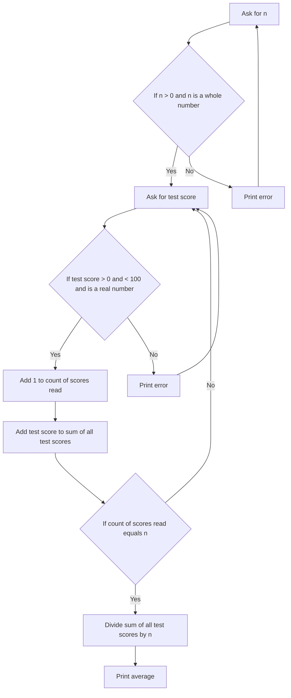

Polya's Problem Solving is a four-step process developed by mathematician George Polya in his book [How to Solve It](https://en.wikipedia.org/wiki/How_to_Solve_It) to solve problems systematically. The steps are:

1. **Understand the Problem**
    - Identify what is being asked.
    - Determine the knowns and unknowns.
    - Visualize the problem, if possible.
2. **Devise a Plan**
    - Think of possible strategies to solve the problem.
    - Consider similar problems and their solutions.
    - Choose the most appropriate strategy.
3. **Carry Out the Plan**
    - Implement the chosen strategy.
    - Perform calculations and follow through with the steps.
    - Keep track of your work to avoid mistakes.
4. **Review/Reflect**
    - Check the solution for accuracy.
    - Reflect on the process and the solution.
    - Consider if there is a simpler or alternative method.

These steps help in breaking down complex problems into manageable parts and finding effective solutions.

For your programming assignments, you will be asked to apply Polya's Problem Solving process to solve the given problems. This will help you develop a structured approach to problem-solving and improve your programming skills.

In your program design assignments, focus on:

- understanding the problem requirements and constraints,
- devising a plan to solve the problem,
- writing test cases to validate your solution.

In your programming assignments, focus on:

- carrying out the plan by writing code,
- testing your code with the provided test cases,
- reviewing your code and solution, considering alternative methods.

Let's have a look at some examples.

## Problem 1: Area of a Rectangle

**Problem Statement:** Write a program that calculates the area of a rectangle given its length and width.

### Understand the Problem

This problem is asking me to get the length of two sides of a rectangle, and I will find the area of a rectangle by multiplying the lengths of the two sides. Then, I will output the result.

#### Assumption(s)

- The user will give me a length for each side that is greater than 0. The number can be a whole number or real number with a decimal point.

#### Functional Requirement(s)

Calculate the area of a rectangle by multiplying its length and width.

#### Input(s)

- Length of the rectangle
- Width of the rectangle

#### Output(s)

- Area of the rectangle

### Devise a Plan / Design

There are no decisions to make in this program, just sequential steps.

1. Print a message for the user to enter the length
2. Get the length from the user
3. Print a message for the user to enter the width
4. Get the width from the user
5. Find the area of the rectangle by multiplying length by width
6. Print the area of the rectangle

### Test Cases

| Length | Width | Area | Expectations |
|--------|-------|------|--------------|
| 5 | 3 | 15 | Works with integers |
| 0 | another number | 0 | We can assume user gives a number strictly greater than 0. |
| 5.5 | 3.5 | 19.25 | Works with real numbers |
| 5.5 | 3 | 16.5 | Works with a mix of real numbers and integers |
| not a number | 3 | Error? No idea. | We can assume the user will give a number strictly greater than 0. |
| -1 | 3 | -3 | We can assume the user will give a number strictly greater than 0. |

## Problem 2: Test Score Average

**Problem Statement:** Write a program that continuously ask the user for `n` test scores. These test scores should range from 0 to 100, and your program needs to check that the scores supplied are valid numbers before moving forward. This may include making sure the user doesn't enter a letter or string of letters.

- Ask the user for the **number** of test scores.
- Repeatedly, ask the user for the test scores.
    - For each test score received, check that the test score is a number and it is between 0-100.
    - Print an error message if the number is not in this range, and re-prompt the user for another number.
- After receiving good test scores, then calculate the average and output it to the screen.

### Understand the Problem

This problem is asking me to read an unsigned whole number value `n` from the user, and then read `n` unsigned real numbers, which represent test scores, from the user.

These scores need to be between 0 and 100, as well as valid real numbers. If the user doesn't enter a valid number or a number in the range, then an error message is printed, and the user is prompted to enter a new number without taking away from the `n` valid numbers the user is entering. After the user enters `n` valid real numbers in the range of 0-100, then the average is calculated and printed to the screen.

#### Assumption(s)

- `n` is an unsigned whole number.
- Test scores can be unsigned real numbers, instead of just integers.
- Errors in the user input does not count against the `n` numbers to enter.
- The average is calculated by summing the `n` valid test scores and dividing by `n` (i.e., it's the mean).

#### Functional Requirement(s)

Calculate the average of `n` test scores that are between 0 and 100.

### Devise a Plan / Design

Here's a flowchart to help visualize the steps:

import Mermaid from "../../../components/Mermaid.astro";

<Mermaid title="">

</Mermaid>

And here's the equivalent "pseudocode":

```text
Declare n as an integer
Prompt user for n
Read n from user
While (n <= 0) or (n not an integer)
    Print error message
    Prompt user for n
    Read n from user
Declare sum as a real number
Declare count as an integer
Set count to 1
While count < n
    Declare testScore as a real number
    Prompt user for testScore
    Read testScore from user
    While (testScore < 0) or (testScore > 100) or (testScore not a real number)
        Print error message
        Prompt user for testScore
        Read testScore from user
    Add 1 to count
    Add testScore to sum
Calculate average as sum / n
Print average
```

### Test Cases

| Variable(s) | Value(s) | Expectations |
|----------|-------|--------------|
| n | 3 | Prompts user for 3 test scores |
| n | 0 | Error message and re-prompts the user for a good n value |
| n | -1 | Error message and re-prompts the user for a good n value |
| n | 3.5 | Error message and re-prompts the user for a good n value |
| testScore | -1 | Error message and re-prompts the user for a good test score |
| testScore | 101 | Error message and re-prompts the user for a good test score |
| testScore | 50.5 | Accepts a test score of 50.5 |
| testScore | not a number | Error message and re-prompts the user for a good test score |
| n, testScore | 1, 100 | Average should be 100 |
| n, testScore, testScore, testScore | 3, 100, 0, 50 | Average should be 50 |
| n, testScore, testScore | 1, 100.5, 0 | Average should be 0 |


